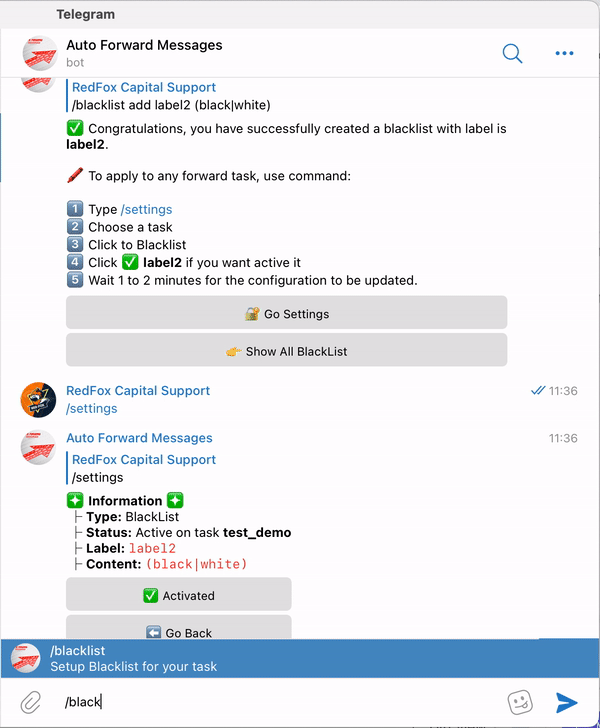

# 🅾 Blacklist: Create And Management


You can set a list of words or regex patterns which tells the bot that **if the message received** from source channel has any of the blacklisted words or regex pattern match the bot should **ignore** that **message** and do not process it even if it passes all other conditions.



**Important Information**

* Using **Simple Syntax** will match words partially. This means that when you blacklist the word **"es"**, it will block every message containing b**es**t, r**es**t, t**es**t because each of them have the word **"es"** within.
* If you want to match words fully, please use the regex example
* Make sure to use the **Python Flavor** with [regex101.com](https://regex101.com/) otherwise your regex will not work on **Auto Forward Telegram**


### ⛳️ Create new blacklist



#### Basic Command

`/blacklist [ACTION] [LABEL] [WORD_LIST]`


**Advanced Command**

`/blacklist [ACTION] [LABEL]_regex [WORD_LIST]`

**Command Information**

* **ACTION**  is **add or remove**
* **LABEL** is the nickname you want to define for your **Blacklist**.
* Do not use number for **LABEL**.&#x20;
* To create **Blacklist** advance with regex please add **LABEL** suffix is **\_regex**
* **WORD\_LIST** is list word you want use as whitelist. Check Tab **Example**



➡️ This will not send all messages containing the word **copyright** \
`/blacklist add black1 copyright`

\
➡️ This will not send all messages containing the word **copyright** or **DMCA** \
`/blacklist add black1 copyright,DMCA`

\
➡️ Remove word list with label **black1** \
`/blacklist remove black1`

\
➡️ Show all list Blacklist \
`/blacklist showall`

\
🛑 Note: **Blacklist** takes precedence over **whitelist** if both are defined.




Use the syntax as shown below when you want to achive result that is not possible with the simple syntax. This syntax uses regex to search for words and its more powerful than Simple Syntax.

**We do not support usage of regex, you are on your own if you decide to use regex. Only use it if you know what you are doing.**



➡️ Block messages only if it has the any **@mention** word on it.\
`/blacklist add black1_regex @\S+`

\
➡️ Block messages only if it has any "telegram links"\
`/blacklist add black2_regex (telegram.me|t.me)/\w+`\


➡️ Block messages only if it has the word **black** or **white**

`/blacklist add black3_regex (black|white)`

* **black and white :** The words `black` and `white` are two words you want block if have one or both
* In case you want to block more, you can add more **|red|blue** in regex

➡️ Block messages only if it has the word **es** fully ( refer to **Important Information** )

`/blacklist add black4_regex \bes\b`

➡️ Block messages only if it has the word **word1 and word2** fully (refer to **Important Information**)\
`/blacklist add black5_regex ^(?=.\bwork1\`_`b)(?=.`_`\bwork2\b).*$`&#x20;

* **work1 and work2 :** The words work1 and work2 are two words you want to block if have both in the content
* In case you want to match more, you can add more _**(?=.**_**\bwork3\b)**_**(?=.**_**\bwork4\b)** in regex


```
* When add blacklist is ^(?=.\bwork1\b)(?=.\bwork2\b).*$ it will only block messages have contain work1 and work2 like:
  "I have work1 to do and work2 as well."
  "work1 and work2 are both important."
  "work2 is harder than work1."
* Will continue forward if not have both work1 and work2 or only have work1 or work2 like:
  "Only work1 is left."
  "work2 is complete"
  "Nothing to do here."
```




### ✅ Apply/Deactivate Blacklist for a Task


**1.**  From **Auto Forward Messages BOT** [Choose Task ](how-to-settings-for-task/)you want Apply

**2.**  Select 🔐 **Advanced Configuration** from **Menu Setting**

**3.**  Select **Blacklist** from **Menu Advanced Configuration to show list Blacklist**

**4.**  Click a your **Blacklist** you want to **Activate or Deactivate** for Task


Describe Status

🚫  **is status Deactivated**

✅ **is status Activated**


<figure><figcaption><p>Apply Blacklist For Task</p></figcaption></figure>

### &#x20;✅ Apply/Disable Blacklist for All Task


When **Apply All Blacklist for Task** will won't activate for each single task


Use Command **/blacklist** after select **Show All Blacklist**




Create new blacklist

