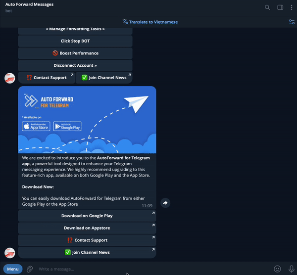

# 🔴 Blacklist: Create And Management


You can set a list of words or regex patterns which tells the bot that **if the message received** from source channel has any of the blacklisted words or regex pattern match the bot should **ignore** that **message** and do not process it even if it passes all other conditions.



**Important Information**

* Using **Simple Syntax** will match words partially. This means that when you blacklist the word **"es"**, it will block every message containing b**es**t, r**es**t, t**es**t because each of them have the word **"es"** within.
* If you want to match words fully, please use the regex example
* Make sure to use the **Python Flavor** with [regex101.com](https://regex101.com/) otherwise your regex will not work on **Auto Forward Telegram**


## Create new blacklist

### 1. Basic Command


```
/blacklist [ACTION] [LABEL] [WORD_LIST]
```


**Command Information**

* **ACTION**  is **add or remove**
* **LABEL** is the nickname you want to define for your **Blacklist**.
* Do not use number for **LABEL**.&#x20;
* **WORD\_LIST** is list word you want use as whitelist. Check **Example**

❇️ **Example** ❇️

➡️ This will not send all messages containing the word **copyright** \
`/blacklist add black1 copyright`

➡️ This will not send all messages containing the word **copyright** or **DMCA** \
`/blacklist add black1 copyright,DMCA`

➡️ Remove word list with label **black1** \
`/blacklist remove black1`

➡️ Show all list Blacklist \
`/blacklist showall`

🛑 Note: **Blacklist** takes precedence over **whitelist** if both are defined.

### **3.** **Advanced Command with regex** ( Only Platinum)


```
/blacklist [ACTION] [LABEL]_regex [WORD_LIST]
```


**Command Information**

* **ACTION**  is **add or remove**
* **LABEL** is the nickname you want to define for your **Blacklist**.
* Do not use number for **LABEL**.&#x20;
* To create **Blacklist** advance with regex please add **LABEL** suffix is **\_regex**
* **WORD\_LIST** is list word you want use as whitelist. Check Tab **Example**


Use the syntax as shown below when you want to achive result that is not possible with the simple syntax. This syntax uses regex to search for words and its more powerful than Simple Syntax.

**We do not support usage of regex, you are on your own if you decide to use regex. Only use it if you know what you are doing.**



**When using regex for spaces please add a \ character in front or use \s+**


❇️ **Example** ❇️

➡️ Block messages only if it has the any **@mention** word on it.\
`/blacklist add black1_regex @\S+`

➡️ Block messages only if it has any "telegram links"\
`/blacklist add black2_regex (telegram.me|t.me)/\w+`\
➡️ Block messages only if it has the word **black** or **white**

`/blacklist add black3_regex (black|white)`

* **black and white :** The words `black` and `white` are two words you want block if have one or both
* In case you want to block more, you can add more **|red|blue** in regex

➡️ Block messages only if it has the word **es** fully ( refer to **Important Information** )

`/blacklist add black4_regex \bes\b`

➡️ Block messages only if it has the word **word1 and word2** fully (refer to **Important Information**)\
`/blacklist add black5_regex ^(?=.\bwork1\`_`b)(?=.`_`\bwork2\b).*$`&#x20;

* **work1 and work2 :** The words work1 and work2 are two words you want to block if have both in the content
* In case you want to match more, you can add more _**(?=.**_**\bwork3\b)**_**(?=.**_**\bwork4\b)** in regex


```
* When add blacklist is ^(?=.\bwork1\b)(?=.\bwork2\b).*$ it will only block messages have contain work1 and work2 like:
  "I have work1 to do and work2 as well."
  "work1 and work2 are both important."
  "work2 is harder than work1."
* Will continue forward if not have both work1 and work2 or only have work1 or work2 like:
  "Only work1 is left."
  "work2 is complete"
  "Nothing to do here."
```


### 4. Filters User use Blacklist  ( Only Platinum Plan)

The blacklist feature allows you to block or ignore messages from specific users. By adding users to a **Blacklist** using their **USER\_ID** or **USER\_NAME**, you can ensure that messages from these users will not be forwarded.

1. **To use this feature, you'll first need to find the User ID of the users you want to blacklist. Follow these steps:**
   * **Go to the chat** where you want to receive messages from specific users.
   * **Use the command** `/getid` in the chat.
   * **Note down the User ID** that appears. You can then add this User ID to your **blacklist**.

<div align="center" data-full-width="true"><figure><figcaption><p>Example</p></figcaption></figure></div>


**Note: To use the `/getid` command, please make sure you are using a Telegram account that is connected to the AutoForward Telegram Bot.**


2. **Next,** use the following syntax to create filters based on the blacklist of users:


```
/blacklist [ACTION] [LABEL]_user [USER_ID1,USER_ID2,...,USERNAME1,USERNAME2,...]
```


**Explanation:**

* `[ACTION]`: The action you want to take (e.g., add, remove, or list).
* `[LABEL]_user`: The label you assign to this blacklist (e.g., `block_user`, `spam_user`).
* `[USER_ID1,USER_ID2,...]`: A list of User IDs.
* `[USERNAME1,USERNAME2,...]`: A list of Usernames.
* You can mix User IDs and Usernames in the same command.

**Example Usage:**

*   Block multiple users to a blacklist using their User IDs:

    <pre class="language-plaintext" data-overflow="wrap"><code class="lang-plaintext">/blacklist add spam_user 12345678,87654321,23456789
    </code></pre>
*   Block multiple users to a blacklist using their Usernames:

    <pre class="language-plaintext" data-overflow="wrap"><code class="lang-plaintext">/blacklist add blocked_user johndoe,janedoe,alice123
    </code></pre>
*   Block users to a blacklist using both User IDs and Usernames:

    <pre class="language-plaintext" data-overflow="wrap"><code class="lang-plaintext">/blacklist add unwanted_user 12345678,johndoe,87654321,alice123
    </code></pre>
*   Block a single user to a blacklist using a User ID:

    <pre class="language-plaintext" data-overflow="wrap"><code class="lang-plaintext">/blacklist add blocked_user 98765432
    </code></pre>
*   Block a single user to a blacklist using a Username:

    <pre class="language-plaintext" data-overflow="wrap"><code class="lang-plaintext">/blacklist add spam_user janedoe
    </code></pre>

This flexibility allows you to manage your blacklist efficiently, accommodating both User IDs and Usernames as needed.

## Apply/Deactivate Blacklist for a Task

**1.** From **Auto Forward Messages BOT** typing command `/blacklist` to show list blacklist

**2.** From **your list blacklist** choose item blacklist you want apply. Then choose will goto detail blacklist

**3.** At **detail blacklist** will show all your task forward

**4.** **Now you can click to task will apply or click Apply To All task if want apply for all**


Describe Status

**Normal status is Deactivate**

✅ **is status Activate**


<figure><figcaption><p>Apply Blacklist For Task</p></figcaption></figure>

## VideoBlacklist


Create new blacklist

