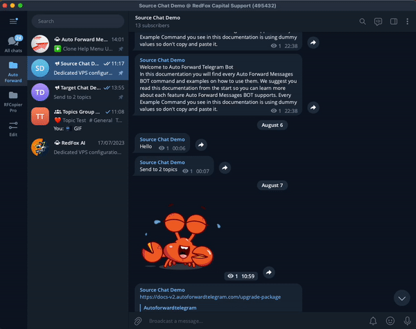
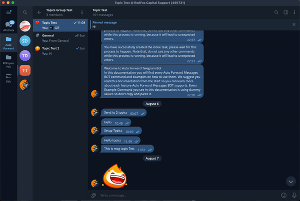
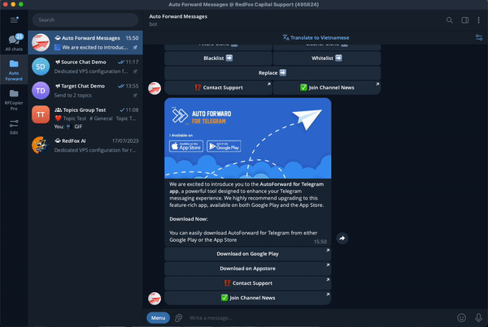
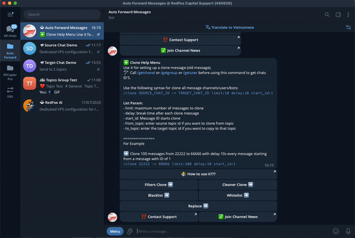
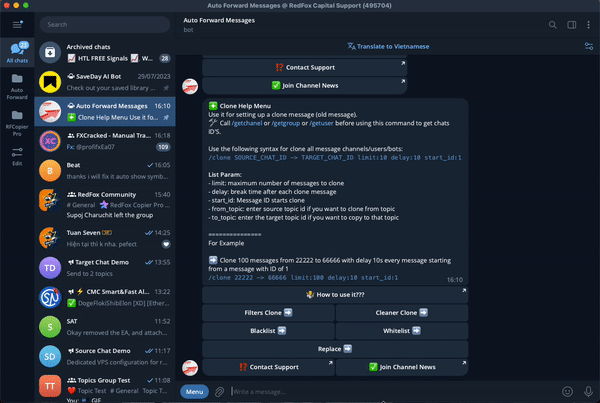

# 🛤 Clone Message


This command is used for cloning (mirror) chats/channels or users messages from SOURCE to DESTINATION



**Important Info**

* When using this command with an current setup, that setup will not be able to send any new message until /clone finishes.
* When using this command, the bot might delay message redirection for your setups.



**Warning**

* Because this commands sends a high amount of messages in a short time it will cause temporary limits from telegram servers. Basically when this happens you will not be able to send any message from this account for **5 minutes** to **1 hour** depending on the limit.
* You will get a notification from the bot when such a limit is encountered (You will also notice yourself since you will not be able to send any message when that happens). There's no way around this other than not using this command.


### What is it used for?

* **Copy a old message** from **Channel/Group/Topic/User** to **Your Channel/Group/Topic**
* **Copy all history** **message** from **Channel/Group/Topic/User** to **Your Channel/Group/Topic/Topic**
* **Backup message** from **Channel/Group/User** to **Your Channel/Group/Topic**
* **Copy/ Backup** with **Feature Advance**&#x20;
  * [**Filters**](clone-message.md#filters-clone)&#x20;
  * [**Cleaner**](clone-message.md#cleaner-clone)&#x20;
  * [**Whitelist**](clone-message.md#blacklist-and-whitelist)
  * [**Blacklist**](clone-message.md#blacklist-and-whitelist)
  * [**Replace**](clone-message.md#replace-clone)&#x20;

## &#x20;❇️ How To Run Command Clone?

Here are a few example syntax on how to do this



Type **/getchanel** or **/getgroup** or **/getuser** on Auto Forward Telegram before using this command to get **SOURCE\_CHAT\_ID** and **TARGET\_CHAT\_ID**&#x20;


```
/clone SOURCE_CHAT_ID -> TARGET_CHAT_ID limit:x delay:x start_id:x from_topic:x to_topic:x
```


**Param describe**

* **SOURCE\_CHAT\_ID**: Source chat ID will clone {**Required**}
* **TARGET\_CHAT\_ID**: Clone to Target chat ID {**Required**}
* **start\_id**: message ID start clone([How to Get](clone-message.md#how-to-get-message-id-start)) {**Optional**, **Default = 2**}
* **limit**: maximum number of messages to clone start from **start\_id** {**Optional**,**Default = 100**}
* **delay**: break time seconds after each clone message {**Optional**,**Default = 5**}
* **from\_topic**: enter source topic id if you want to clone from group have topics([How to Get](clone-message.md#how-to-get-topic-id)) {**Optional**, **Default = 0**}
* **to\_topic**: enter the target topic id if you want to copy to group topics([How to Get](clone-message.md#how-to-get-topic-id)) {**Optional**, **Default = 0**}



❇️ I have a Channel Source have name is **Source Chat Demo** with **ID = 1656164752** and **Target** is channel have name is **Target Chat Demo** with **ID = 1716791967**

➡️ I want clone 100 message start from first message and each copy is spaced 5 seconds apart


```
/clone 1656164752 -> 1716791967
```


➡️ I  want **clone** **10 message** **start from first message** and each copy is spaced **10 seconds** apart


```
/clone 1656164752 -> 1716791967 limit:10 delay:10
```


➡️ I want **clone** **10 message** **start from** [**message\_id**](clone-message.md#how-to-get-message-id-start) **is 7512** and each copy is spaced **3 seconds** apart


```
/clone 1656164752 -> 1716791967 limit:10 delay:3 start_id:7512
```


* **Example For Group Topics to Channel**

❇️ I have a **Group Source** have support **Topics,** group name is **Topics Group Test** with **ID = 1894696594** and [**Topic\_ID**](clone-message.md#how-to-get-topic-id) **= 2 and Target** is channel have name **Target Chat Demo** with **ID = 1716791967**

➡️ I want **clone** **10 message** in [**Topic\_ID**](clone-message.md#how-to-get-topic-id) **= 2** and **start from** [**message\_id**](clone-message.md#how-to-get-message-id-start) **is 7** and each copy is spaced **3 seconds** apart


```
/clone 1894696594 -> 28887387 limit:10 delay:3 start_id:7 from_topic:2
```


* **Example For Group Topics to Group Topics**

❇️ I have a **Group Source** have support **Topics,** group name is **Topics Group Test** with **ID = 1894696594** and [**Topic\_ID**](clone-message.md#how-to-get-topic-id) **= 2** and a **Group Target** have support **Topics,** group name is **Target** **Topics Group Test** with **ID = 1818893682** and [**Topic\_ID**](clone-message.md#how-to-get-topic-id) **= 2**&#x20;

➡️ I want **clone** **10 message** in **Topic\_ID =2** and **start from** [**message\_id**](clone-message.md#how-to-get-message-id-start) **is 7** and each copy is spaced **3 seconds** apart to **Group Target have** [**Topic\_ID**](clone-message.md#how-to-get-topic-id) **=4**


```
/clone 1894696594 -> 1818893682 limit:10 delay:3 start_id:7 from_topic:2 to_topic:4
```




#### # How to Get message ID start?

1. From Source Clone scroll to message you want start copy
2. Click right click select **Copy Post Link** from **Message**
3. We will receive link same like **"https://t.me/c/1656164752/7553"**&#x20;
4. Copy Message\_ID is last path, corresponding = **7553**

<figure><figcaption></figcaption></figure>

#### # How to Get Topic ID?


**Topics are only supported when the source or target is a Group**


1. From Group Source Clone or Target
2. &#x20;Click right click select **Copy Post Link** from **Message**
3. We will receive link same like **"https://t.me/c/1656164752/2/7553"**&#x20;
4. Copy **Topic\_ID** is path near the end, corresponding = **2**

<figure><figcaption><p>How to get TopicID</p></figcaption></figure>


Clone Message


## ❇️ How To Setup Condition For Clone?

From BOT **Auto Forward Messages** type **/clone** or click Menu and **select /clone** to get **describe**

<figure><figcaption><p>Select clone from menu bot</p></figcaption></figure>

<figure><figcaption><p>Menu Clone</p></figcaption></figure>

### Filters Clone

This menu is used to filters messages by type when process clone.&#x20;


```
🚫  is status Deactivated - if you want keep when clone
✅  is status Activated - if you want to ignore
```




* **Document:** check ✅ if you want to **ignore document messages**
* **Video:** check ✅ if you want to **ignore video messages**
* **Audio:** check ✅ if you want to **ignore audio messages**
* **Sticker:** check ✅ if you want to **ignore sticker messages**
* **Text:** check ✅ if you want to **ignore messages** that **contain text**
* **Forwards:** check ✅ if you want to **ignore "Forwarded from" messages**
* **Photos:** check ✅ if you want to **ignore photo messages**
* **Polls:** check ✅ if you want to **ignore poll messages**
* **Voice:** check ✅ if you want to **ignore voice messages**
* **Animation(GIFS):** check ✅ if you want to **ignore animation messages**
* **Video note:** check ✅ if you want to **ignore video note**
* **Reply:** check ✅ if you want to **ignore reply messages**
* **Link:** check ✅ if you want to **ignore link messages**
* **Buttons:** check ✅ if you want to **ignore button messages**
* **Photos without Text:** check ✅ if you want to **ignore post Photo without Text**
* **Without Username:** check ✅ if you want to **ignore post of Users Without Username on Telegram (ONLY FOR GROUP)**

<figure><figcaption><p>Menu Filters Clone</p></figcaption></figure>



### Cleaner Clone

This menu is used to remove text, video, photo etc from messages when clone if the **conditions match.** It's basically **Filters** but instead of ignoring or allowing messages, **it removes the content it matches**


```
🚫  is status Deactivated - if you want keep when clone
✅  is status Activated - if you want removes the content it matches type
```




* **Document:** check ✅ if you want to **remove document messages**
* **Videos:** check ✅ if you want to **remove video messages**
* **Audio:** check ✅ if you want to **remove audio messages**
* **Sticker:** check ✅ if you want to **remove sticker messages**
* **Text:** check ✅ if you want to **remove messages** that **contain text**
* **Photos:** check ✅ if you want to **remove photo messages**
* **Hashtag:** check ✅ if you want to **remove hashtag messages**
* **Mention:** check ✅ if you want to **remove mention messages**
* **Photos without Text:** check ✅ if you want to **remove messages only contain Photo**
* **URL:** check ✅ if you want to **remove link messages**
* **URL Preview:** check ✅ if you want to **remove preview url**

<figure><figcaption></figcaption></figure>



### BlackList And Whitelist

**This is feature help clone and filter content by whitelist and blacklist**


If you do not have a **whitelist**, you can create it by following these [instructions](whitelist-create-and-management.md#create-new-whitelist)

If you do not have a **blacklist**, you can create it by following these [instructions](blacklist-create-and-management.md#create-new-blacklist)


### ✅ Activate/Deactivate Whitelist/BlackList for a Clone

**1.**  Select **Whitelist or Blacklist** from **Menu Clone to show list Whitelist or BlackList**

<figure><figcaption><p>Select <strong>Whitelist or Blacklist</strong></p></figcaption></figure>

**2.**  Click to your **Whitelist** you want to **Activate or Deactivate** for Clone


```
🚫  is status Deactivated
✅  is status Activated
```


<figure><figcaption><p><strong>Activate or Deactivate</strong> for Clone</p></figcaption></figure>

### Replace Clone

**This is feature help replace content before clone**&#x20;


If you do not have a **replace**, you can create it by following these [instructions](replace-create-and-management.md#create-new-replace)


**1.**  Select **Replace** from **Menu Clone to show list Replace**

<figure><figcaption><p>Select <strong>Replace</strong> from <strong>Menu Clone</strong></p></figcaption></figure>

**2.**  Click to your **Replace** you want to **Activate or Deactivate** for Clone


```
🚫  is status Deactivated
✅  is status Activated
```


<figure><figcaption><p><strong>Activate or Deactivate</strong> for Clone</p></figcaption></figure>



## Add Header and Footer when Clone


You can add a header or footer for each post when clone to channels target




To reach this first you will need to type **/clone** on **Auto Forward Telegram BOT.** Now click on  **Add Header or Add Footer** ➡️&#x20;

<figure><figcaption></figcaption></figure>

&#x20; ➡️ **Enter text content you want show .**

#### Or it can be a display reference to some value as follows

📖 Use Short code to refer:

&#x20; ➡️  **Enter EMPTY if you don't want to show the header.**&#x20;

&#x20; ➡️ **\n** if you want break line.

&#x20; ➡️ **\t** if you want spaces.

&#x20; ➡️ **\[\[ORIGIN\_USERNAME]]** if you want to show the sender username

&#x20; ➡️ **\[\[ORIGIN\_USERID]]** if you want to show the sender userid

&#x20; ➡️ **\[\[ORIGIN\_TEXT]]** if you want to show original content.&#x20;

&#x20; ➡️ **\[\[ORIGIN\_NAME]]** if you want to show the sender name or name original channel.&#x20;

&#x20; ➡️ **\[\[ORIGIN\_POST\_ID]]** if you want show Post ID origin.&#x20;

&#x20; ➡️ **\[\[ORIGIN\_CHAT\_ID]]** if you want show CHAT ID origin.

&#x20; ➡️ **\[\[ORIGIN\_QUOTED\_TEXT]]** if you want to display the original post's QUOTED TEXT.

&#x20; ➡️ **\[\[ORIGIN\_NAME\_URL]]** if you want to show the original link.

&#x20; ➡️ **\[\[FROM\_USER]]** if you want to show the username of sender.

&#x20; ➡️ **\[\[SOURCE\_NAME]]** if you want to show forward source name.

&#x20; ➡️ **\[\[SENDER\_CHAT]]** if you want to show name display of sender.

&#x20; ➡️ **\[\[FORWARD\_FROM\_CHAT]]** if you want to show message owner name

&#x20; ➡️ **\[\[ORIGIN\_POST\_DATE]]** if you want to show post date created



## Show header forward when clone


**Show Header Forwarder :** check ✅ if you want all clone messages will be prefixed with "Forwarded from ...".&#x20;




<figure><figcaption></figcaption></figure>

To reach this first you will need to type **/clone** on **Auto Forward Telegram BOT.** Now click on  **Show Header Forwarder** ➡️&#x20;


