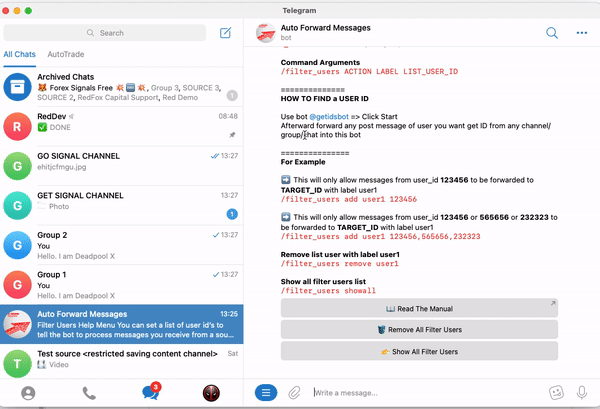
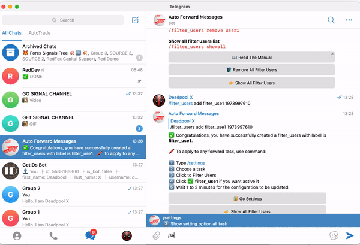
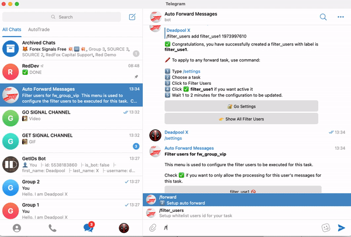
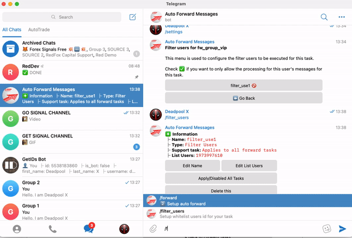

# 🧙♂ Filter Users


You can set a list of user id s to tell the bot to process messages you receive from source group only if it matches at least one of the user id's on the list.

🛑 **This feature work only for group**




Command Arguments\
`/filter_users ACTION LABEL LIST_USER_ID`

\==============

**HOW TO FIND a USER ID**

Use bot [@getidsbot](https://t.me/getidsbot) => Click Start&#x20;

Afterward forward any post message of user you want get ID from any channel/group/chat into this bot





*   For Example

    ➡️ This will only allow messages from user\_id **123456** to be forwarded to **TARGET\_ID** with label **user1** \
    `/filter_users add user1 123456`

    ➡️ This will only allow messages from user\_id **123456** or **565656** or **232323** to be forwarded to **TARGET\_ID** with label **user1** \
    `/filter_users add user1 123456,565656,232323`

    ➡️ Remove list user with label **user1** \
    `/filter_users remove user1`

    Show all filter users list \
    `/filter_users showall`



### ✅ Apply/Disable Filter Users For a Task


Please [disable Filter User All ](filter-users.md#apply-disable-filter-users-for-all-task)before apply for a task


Use command **/setting** after select **Task** want apply

### ✅ Apply/Disable Filter Users For All Task


When **Apply All Filter Users for Task** will won't activate for each single task


Use command **/filter\_users** after select **Show All Filter Users**

### ✅ Remove All **Filter Users**

Use command **/filter\_users** after select **Remove All Filter Users**

