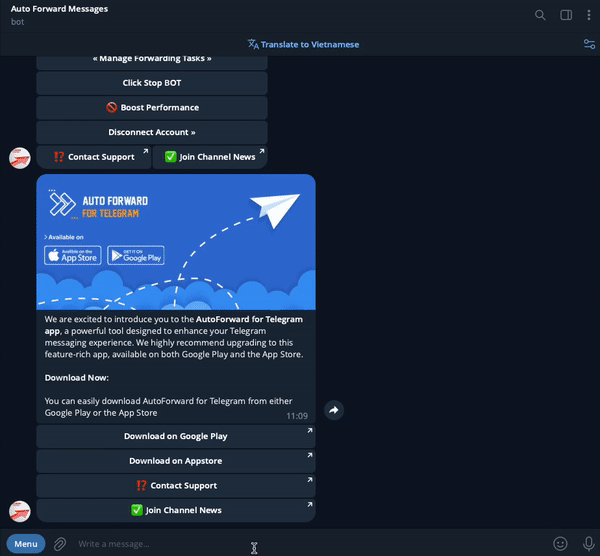

# Apply Replace For Task

**1.**  From **Auto Forward Messages BOT** [Choose Task ](./)you want Apply

**2.**  Select 🔐 **Advanced Configuration** from **Menu Setting**

**3.**  Select **Replace** from **Menu Advanced Configuration to show list replace**

**4.**  Click a your replace you want to **Activate or Deactivate** for Task


Describe Status

🚫  **is status Deactivated**

✅ **is status Activated**


<figure><figcaption>
Apply Replace For Task
</figcaption></figure>
