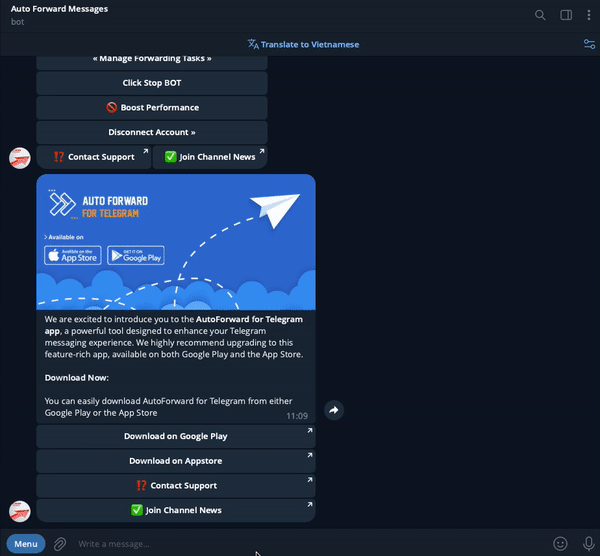

# Apply Whitelist For Task

**1.**  From **Auto Forward Messages BOT** [Choose Task ](./)you want Apply

**2.**  Select 🔐 **Advanced Configuration** from **Menu Setting**

**3.**  Select **Whitelist** from **Menu Advanced Configuration to show list Whitelist**

**4.**  Click a your **Whitelist** you want to **Activate or Deactivate** for Task


Describe Status

🚫  **is status Deactivated**

✅ **is status Activated**


<figure><figcaption>
Apply Blacklist For Task
</figcaption></figure>
