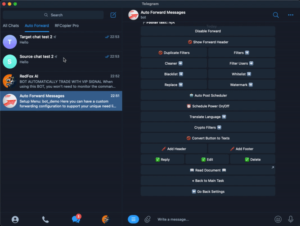

# Convert Buttons To Text


**This is a feature help you convert post buttons to text**




✅ Post contain buttons

.png>)

➡️ After Convert To Text:

**Please select the service you are interested in**

VIP SIGNAL

BOT Auto Trade

Cheap Forex VPS

Best ZERO spread Forex Broker

Contact Support





**Step 1.** To reach this first you will need to type **/settings** on **Auto Forward Telegram BOT.**&#x20;

**Step 2.** Now choose **task** you want **Convert Buttons To Text**&#x20;

.png>)

**Step 3**. At Menu settings click **Convert Buttons To Text** to ✅ **TURN ON** or click to 🚫 **TURN OFF**

.png>)

### ❇️ DEMO




