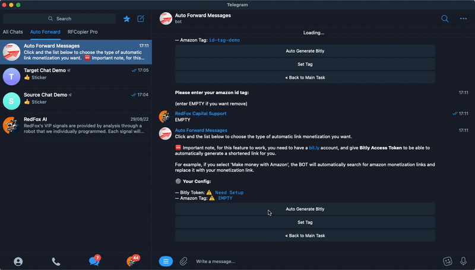

# 🛍 Make Money With Amazon


This is feature support make money with Amazon


<figure><figcaption>
Product advertisements
</figcaption></figure>

### **When do you need to use?**

&#x20;   ➡️ You have posts that introduce products and contain **links to the amazon website**.&#x20;

&#x20;   ➡️ You want replace that links with a your **Amazon Affiliate ID Tag**.

&#x20;   ➡️ You want Auto Generate amazon affiliate link to **URL Short Bitly.**



To reach this first you will need to type **/settings** on **Auto Forward Telegram BOT.** Now click on **your task** so you can access the setup settings. Finally the **MMO Utils** ➡️ **Make Money with Amazon.**

<figure><figcaption>
Make Money With Amazon
</figcaption></figure>



* **Set Tag:**  Amazon Tag ID affiliate you want change or add to link.

<figure><figcaption>
Setup your amazon id tag
</figcaption></figure>

<figure><figcaption>
Demo Set Tag
</figcaption></figure>

➡️  After complete setup it will **auto replace \&tag in link equals your tag id.**


To **REMOVE.** Please enter tag is **EMPTY**


*   **Auto Generate Bitly:** Auto generate a URL short link with[ bit.ly.](https://bit.ly)

    * With feature this you will need done setup a **Bitly Access Token.**&#x20;

    &#x20;     If you don't know how to get it, please login your [bit.ly](https://bit.ly) account. After visit the following link: [click here](https://app.bitly.com/settings/api/).

<figure><figcaption>
<strong>Bitly Generate Access Token.</strong>
</figcaption></figure>

➡️ Next. Back to Auto Forward Bot


_**Please change \*\*\*\*\*\*\*\*\*\*\*\*\*\*\*\*\*\*\*\*\*\*\*L4fMblPrpZ to your Bitly Token**_


<figure><figcaption>
Setup Auto Generate Bitly
</figcaption></figure>

➡️  **After complete setup bitly it will auto generate link amazon to URL short link bit.ly**

<figure><figcaption>
Demo <strong>generate short link</strong>
</figcaption></figure>


To **TURN OFF.** Please enter bitly token is **EMPTY**

