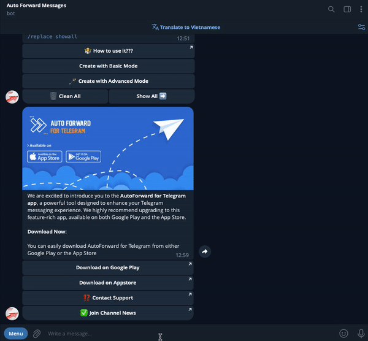

# 🌀 Replace : Create And Management


You can set a list of words or regex patterns which tells the bot that if the message received from source channel has any of the replace words or regex pattern match the bot should replace that message with the word you want to change.



This feature will not work if you enable "**Show Header Forwarder**" in task list


### ⛳️ Create new Replace



➡️ Command Arguments\
`/replace ACTION LABEL Original_WORD -> NEW_WORD`\
\
➡️ USE Regex\
`/replace ACTION LABEL_regex Regex_syntax -> NEW_WORD`

➡️ **Command Information**

* **ACTION**  is **add or remove**
* **LABEL** is the nickname you want to define for your **Replace**.
* Do not use number for **LABEL**.&#x20;
* To create whitelist advance with regex please add **LABEL** suffix is **\_regex**
* **Original\_WORD** is word you want replace. Check Tab **Example**
* **NEW\_WORD** is  word will replace. Check Tab **Example**



Use the syntax as shown below when you want to replace words or full paragraphs.\
\
➡️ Change **black** to **white**\
**`/replace add re1 black -> white`**

➡️ Remove keyword **black** from the message\
`/replace add re1 black -> EMPTY`

➡️ Remove keyword **do not** from the message **i do not like black**


```
/replace add re1 do not -> EMPTY
```



```
i like black
```


➡️ Change **under the moon** to **on** **the** **sun** in content **Sometimes I lay under the moon**


```
/replace add re2 under the moon -> on the sun
```



```
Sometimes I lay on the sun
```





Use the syntax as shown below when you want to achive result that is not possible with the simple syntax. This syntax uses regex to replace words and keywords and you can do everything you want with the message if you know regex.



**We do not support usage of regex, you are on your own if you decide to use regex. Only use it if you know what you are doing.**


➡️ Change **good** or **perfect** to **bad**\
`/replace add re1_regex (good|perfect) -> bad`

➡️ Match every **url** or **@mention** and change it to @Auto\_Forward\_Messages\_Bot \
/replace add re1\_regex (@|www|https?)\S+ -> @Auto\_Forward\_Messages\_Bot

➡️ Refactor content use regex. Remove _"**✉️TPA trading report:", "TPA: Entry", "The monitoring will be continued."**_  in content below 👇

```
✉️TPA trading report:
TPA: Entry BUY  UUDCHF M30 at 2023.06.16 15:30
The monitoring will be continued.
```


```
/replace add radim_r2_regex (?:.*)(BUY|SELL)(.*)\n(?:.*) -> \1\2
```



```
BUY  UUDCHF M30 at 2023.06.16 15:30
```


➡️ Refactor content use regex. Change all _"_**Take profit (1|2|3)**👉**at**_**"**_  to **TP** in content below 👇

```
🚨Signal Alert🚨 
GOLD sell at (@ 1966.40)
Take profit 1👉at 1955.35 
Take profit 2👉at 1938.94 
Take profit 3👉at 1918.62 
Stop loss at 1982.45
🎯Chance of success: 83% 
⚠️Risk 1-2% per trade!
```


```
/replace add changeTP_regex ^(Take\s*profit\s*\d(?:➡️|👉)at) -> TP
```



```
🚨Signal Alert🚨 
GOLD sell at (@ 1966.40)
TP 1955.35 
TP 1938.94 
TP 1918.62 
Stop loss at 1982.45
🎯Chance of success: 83% 
⚠️Risk 1-2% per trade!
```




Use the syntax as shown below when you want to replace words or full paragraphs.\
**Hello. How are you?**\
➡️ Change **Hello. How are you?** to **Hi**\
**`/replace add re1`** **`[[FULL_TEXT]]  -> Hi`**

➡️ Change **Hello. How are you?** to original content and Signature Source\
**`/replace add re1`** **`[[FULL_TEXT]]  -> [[ORIGIN_TEXT]]`**` ``- by`` `**`[[SOURCE_NAME]]`**



### ⛳️ Create new Replace Use ShortCode

<details>

<summary>➡️ USE Combine with ShortCode</summary>

✅ **Original\_WORD** is word you want replace. You can use **ShortCode**:

&#x20;  **\[\[FULL\_TEXT]]** if you want replace all content in message

✅ **NEW\_WORD** is  word will replace. You can combine with **ShortCode**:

&#x20;  **\[\[ORIGIN\_USERNAME]]** if you want to replace with more the sender username

&#x20;  **\[\[ORIGIN\_USERID]]** if you want to replace with more the sender userid

&#x20;  **\[\[ORIGIN\_TEXT]]** if you want to replace with more original content.&#x20;

&#x20;  **\[\[ORIGIN\_NAME]]** if you want to replace with more the sender name or name original channel.&#x20;

&#x20;  **\[\[ORIGIN\_POST\_ID]]** if you want replace with more Post ID origin.&#x20;

&#x20;  **\[\[ORIGIN\_CHAT\_ID]]** if you want replace with more CHAT ID origin.

&#x20;  **\[\[ORIGIN\_QUOTED\_TEXT]]** if you want to replace with more the original post's QUOTED TEXT.

&#x20;  **\[\[ORIGIN\_NAME\_URL]]** if you want to replace with more the original link.

&#x20;  **\[\[FROM\_USER]]** if you want to replace with more the username of sender.

&#x20;  **\[\[SOURCE\_NAME]]** if you want to replace with more forward source name.

&#x20;  **\[\[SENDER\_CHAT]]** if you want to replace with more name display of sender.

&#x20;  **\[\[FORWARD\_FROM\_CHAT]]** if you want to replace with more message owner name

</details>


✅ Apply/Disable Replace For a Task

**1.**  From **Auto Forward Messages BOT** [Choose Task ](how-to-settings-for-task/)you want Apply

**2.**  Select 🔐 **Advanced Configuration** from **Menu Setting**

**3.**  Select **Replace** from **Menu Advanced Configuration to show list replace**

**4.**  Click a your replace you want to **Activate or Deactivate** for Task


Describe Status

🚫  **is status Deactivated**

✅ **is status Activated**


<figure><figcaption><p>Apply Replace For Task</p></figcaption></figure>

### ✅ Apply/Disable Replace For All Task


When **Apply All Replace for Task** will won't activate for each single task


Use command **/replace** after select **Show All Replace**


### ✅ Remove All Replace

Use command **/replace** after select **CLEAR ALL**

<figure><figcaption><p>Remove all replace</p></figcaption></figure>


