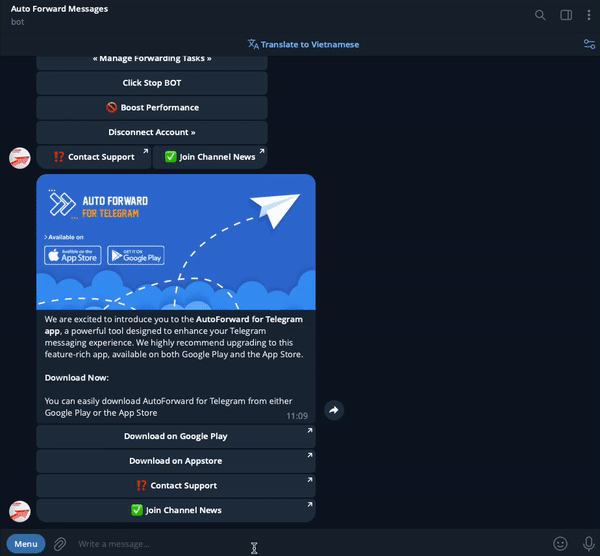
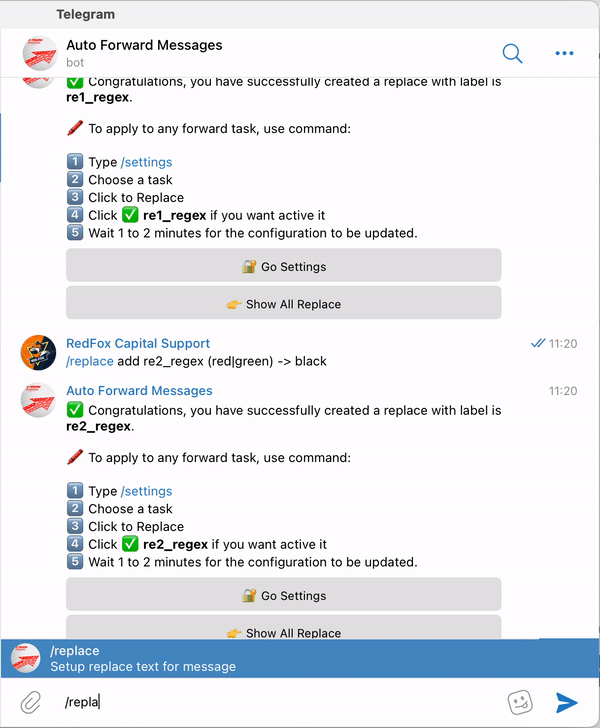
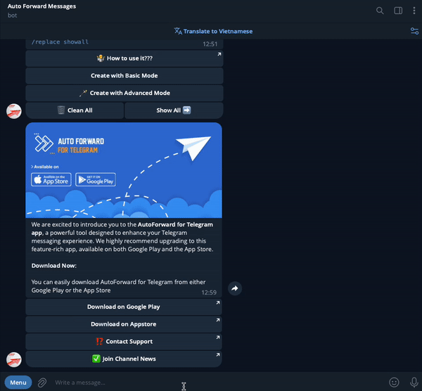

# 🌀 Replace : Create And Management


You can set a list of words or regex patterns which tells the bot that if the message received from source channel has any of the replace words or regex pattern match the bot should replace that message with the word you want to change.


## **Overview**

The **Replace** feature in Auto Forward Bot allows you to modify message content before it is forwarded. This is particularly useful when you want to:

* Customize forwarded messages to match your target audience.
* Remove sensitive or unwanted information.
* Add consistent branding or formatting.


<mark style="color:red;">This feature will not work if you enable "</mark><mark style="color:red;">**Show Header Forwarder**</mark><mark style="color:red;">" in task list</mark>


## &#x20;Create New Replace

### 1. USE Basic


```
/replace ACTION LABEL Original_WORD -> NEW_WORD
```


➡️ **Command Information**

* **ACTION**  is **add or remove**
* **LABEL** is the nickname you want to define for your **Replace**.
* Do not use number for **LABEL**.&#x20;
* **Original\_WORD** is word you want replace. Check Tab **Example**
* **NEW\_WORD** is  word will replace. Check **Example**

❇️ **Example** ❇️

Use the syntax as shown below when you want to replace words or full paragraphs.\
\
➡️ Change **black** to **white**\
&#xNAN;**`/replace add re1 black -> white`**

➡️ Remove keyword **black** from the message\
`/replace add re1 black -> EMPTY`

➡️ Remove keyword **do not** from the message **i do not like black**


```
/replace add re1 do not -> EMPTY
```



```
i like black
```


➡️ Change **under the moon** to **on** **the** **sun** in content **Sometimes I lay under the moon**


```
/replace add re2 under the moon -> on the sun
```



```
Sometimes I lay on the sun
```


### 2. USE Regex


```
/replace ACTION LABEL_regex Regex_syntax -> NEW_WORD
```


➡️ **Command Information**

* **ACTION**  is **add or remove**
* **LABEL** is the nickname you want to define for your **Replace**.
* Do not use number for **LABEL**.&#x20;
* <mark style="color:orange;">**Must use suffix for LABEL**</mark> is <mark style="color:orange;">**\_regex**</mark>
* **Original\_WORD** is word you want replace. Check  **Example**
* **NEW\_WORD** is  word will replace. Check **Example**


Use the following syntax when simple syntax is insufficient. This advanced syntax utilizes regex to replace words and keywords, allowing complete manipulation of the message if you're



**We do not support usage of regex, you are on your own if you decide to use regex. Only use it if you know what you are doing.**



**To match spaces in regex, add a \ character before the space or use \s**


❇️ **Example** ❇️

➡️ Change **good** or **perfect** to **bad**

```
/replace add re1_regex (good|perfect) -> bad
```

➡️ Match every **url** or **@mention** and change it to @Auto\_Forward\_Messages\_Bot \
/replace add re1\_regex (@|www|https?)\S+ -> @Auto\_Forward\_Messages\_Bot

➡️ Exam1: Refactor content use regex. Remove _"**✉️TPA trading report:", "TPA: Entry", "The monitoring will be continued."**_  in content below 👇

```
✉️TPA trading report:
TPA: Entry BUY  UUDCHF M30 at 2023.06.16 15:30
The monitoring will be continued.
```


```
/replace add radim_r2_regex (?:.*)(BUY|SELL)(.*)\n(?:.*) -> \1\2
```



```
BUY  UUDCHF M30 at 2023.06.16 15:30
```


➡️ Exam2: Refactor content use regex. Change all _"_**Take profit (1|2|3)**&#xD83D;�**at**_**"**_  to **TP** in content below 👇

```
🚨Signal Alert🚨 
GOLD sell at (@ 1966.40)
Take profit 1👉at 1955.35 
Take profit 2👉at 1938.94 
Take profit 3👉at 1918.62 
Stop loss at 1982.45
🎯Chance of success: 83% 
⚠️Risk 1-2% per trade!
```


```
/replace add changeTP_regex ^(Take\s*profit\s*\d(?:➡️|👉)at) -> TP
```



```
🚨Signal Alert🚨 
GOLD sell at (@ 1966.40)
TP 1955.35 
TP 1938.94 
TP 1918.62 
Stop loss at 1982.45
🎯Chance of success: 83% 
⚠️Risk 1-2% per trade!
```


**➡️ Exam 3:  Refactor content use regex. Change all to new format in content below 👇**


```
🔥 #RDNT/USDT (Long📈, x20) 🔥

Entry - 0.2483
SL - 25-30%

Take-Profit:
🥇 0.2534 (40% of profit)
🥈 0.256 (60% of profit)
🥉 0.2586 (80% of profit)
🚀 0.2614 (100% of profit)
```



```
/replace add re_signal_regex (?:.*\#)(.*)\s+(?:.*Long.*\,\s+(\w+)(?:.*))\n+(?:Entry.*)\s+(\d+.?\d+)\s+(?:SL.*\-)(?:.*)\s+(\d+\-\d+)(?:\%)\n+(?:.*:)\n(?:.*)\s+(\d+.?\d+)(?:.*)\n(?:.*)\s+(\d+.?\d+)(?:.*)\n(?:.*)\s+(\d+.?\d+)(?:.*)\n(?:.*)\s+(\d+.?\d+)(?:.*) -> \1 Binance futures\nLEVERAGE CROSS \2\nBUY   \3\nSELL: \5 \6 \7 \8\nSTOP: \4%
```



```
RDNTUSDT Binance futures
LEVERAGE CROSS 20X
BUY   0.2483
SELL: 0.2534 0.256 0.2586 0.2614
STOP: 25%
```


Video: [Regex Magic: Beyond Your Imagination | Replace Advanced Feature](./#regex-magic-beyond-your-imagination-or-replace-advanced-feature)

## Replace Power

This is a powerful bot replacement feature. It is used to remove and change keywords from messages by combining multiple syntaxes. You can use **regex** with this feature.


**To apply multiple replace rules at once you just need to place them in a newline**


### 1. Syntax Command


```
/replace ACTION LABEL_power [[ALL_IN_ONE]] -> "Original_WORD_1","NEW_WORD"
Regex_Syntax=NEW_WORD
```



```
/replace ACTION LABEL_power [[ALL_IN_ONE]] -> "Original_WORD_1","NEW_WORD"
"Original_WORD_2","NEW_WORD"
"Original_WORD_3","NEW_WORD"
..
Add Unlimited
```



```
/replace ACTION LABEL_power [[ALL_IN_ONE]] -> Regex_Syntax=NEW_WORD
Regex_Syntax=NEW_WORD
Regex_Syntax=NEW_WORD
..
Add Unlimited
```


➡️ **Command Information**

* **ACTION**  is **ADD or REMOVE**
* **LABEL** is the nickname you want to define for your **Replace**.
* Do not use number for **LABEL**.&#x20;
* <mark style="color:orange;">**Must use suffix for LABEL**</mark> is <mark style="color:orange;">**\_power**</mark>
* **\[\[ALL\_IN\_ONE]]** is shortcode. Keep it after **Label**
* **Original\_WORD** is word you want replace. Can use **Regex**
* **NEW\_WORD** is  word will replace.

❇️ **Input** **Syntax Simple Example** ❇️

➡️ Change **good** to **bad**\
`/replace add re1_power [[ALL_IN_ONE]] -> "good","bad"`

➡️ Change **20** to **50** and **2+5=7** to **6+4=10**


```
/replace add re2_power [[ALL_IN_ONE]] -> "20","50"
"2+5=7","6+4=10"
```


➡️ Remove keyword **black** from the message

```
/replace add re3_power [[ALL_IN_ONE]] -> "black",""
```

#### ❇️ **Input Syntax Example (Advanced)** ❇️

➡️ Change **telegram.me** or **tm.me** to **autoforwardtelegram.com**


```
/replace add re4_power [[ALL_IN_ONE]] -> (telegram\.me|tm\.me)=autoforwardtelegram.com
```


➡️ Use regex to match **gray** or **grey** and change it to **red**


```
/replace add re4_power [[ALL_IN_ONE]] -> gr[ae]y=red
```


➡️ Unshort urls, match **tag** (query) and change it to **customer**

```
/replace add re4_power [[ALL_IN_ONE]] -> url:tag=customer
```

➡️ **Match every url** or **@mention** and change it to **@Auto\_Forward\_Messages\_Bot**


```
/replace add re4_power [[ALL_IN_ONE]] -> (@|www|https?)\S+=@Auto_Forward_Messages_Bot
```


➡️  **To apply multiple transformation rules at once you just need to place them in a newline**


```
/replace add re1_power [[ALL_IN_ONE]] -> "2+1=3","2+2=4"
"red",""
(@|www|https?)\S+=@Auto_Forward_Messages_Bot
url:tag=customer
```


## Create New Replace Use ShortCode

➡️ Command Arguments


```
/replace ACTION LABEL Original_WORD -> NEW_WORD
```


➡️ **Command Information**

* **ACTION**  is **add or remove**
* **LABEL** is the nickname you want to define for your **Replace**.
* Do not use number for **LABEL**.&#x20;
* **Original\_WORD** is word  or **short code** you want replace.&#x20;
* **NEW\_WORD** is  word or **short code** will replace.

### ❇️ ShortCode Guide ❇️

✅ **`Original_WORD`** is the word or phrase in the source message that you want to replace.\
You can use the following ShortCodes:

* `[[FULL_MESSAGE]]`: Extracts the full content of the message, including text, media, and other types
* `[[FULL_TEXT]]`: Extracts only the text content from the original message

***

✅ **`NEW_WORD`** is the value that will replace the original word. You can combine it with these ShortCodes:

🔹 Message & Sender Info

| ShortCode                | Description                                                           |
| ------------------------ | --------------------------------------------------------------------- |
| `[[ORIGIN_USERNAME]]`    | Username of the original sender                                       |
| `[[ORIGIN_USERID]]`      | Telegram user ID of the original sender                               |
| `[[ORIGIN_TEXT]]`        | The original message text                                             |
| `[[ORIGIN_NAME]]`        | Full name of the original sender or name of the original channel      |
| `[[ORIGIN_POST_ID]]`     | Post ID of the original message                                       |
| `[[ORIGIN_CHAT_ID]]`     | Chat ID of the original message                                       |
| `[[ORIGIN_QUOTED_TEXT]]` | Quoted text from the original post                                    |
| `[[ORIGIN_NAME_URL]]`    | A clickable link to the original sender or channel                    |
| `[[FROM_USER]]`          | Username of the user who forwarded the message                        |
| `[[SOURCE_NAME]]`        | Name of the original source or channel the message was forwarded from |
| `[[SENDER_CHAT]]`        | Display name of the sender                                            |
| `[[FORWARD_FROM_CHAT]]`  | Original chat or channel name if the message was forwarded            |

🔹 Current Time Info

| ShortCode               | Description                |
| ----------------------- | -------------------------- |
| `[[CURRENT_TIME]]`      | Current time (HH:MM:SS)    |
| `[[CURRENT_DATE]]`      | Current date (DD/MM/YYYY)  |
| `[[CURRENT_DATETIME]]`  | Full current date and time |
| `[[CURRENT_TIMESTAMP]]` | Current Unix timestamp     |

🔹 Original Post Timestamps

| ShortCode                        | Description                             |
| -------------------------------- | --------------------------------------- |
| `[[ORIGIN_POST_TIME]]`           | Time (only) of the original post        |
| `[[ORIGIN_POST_DATE_FORMATTED]]` | Formatted date of the original post     |
| `[[ORIGIN_POST_DATETIME]]`       | Full date and time of the original post |

🔹 Sender Personal Info

| ShortCode               | Description                         |
| ----------------------- | ----------------------------------- |
| `[[ORIGIN_FIRST_NAME]]` | First name of the original sender   |
| `[[ORIGIN_LAST_NAME]]`  | Last name of the original sender    |
| `[[ORIGIN_PHONE]]`      | Phone number of the sender (if any) |

🔹 Media & File Info

| ShortCode        | Description                            |
| ---------------- | -------------------------------------- |
| `[[MEDIA_TYPE]]` | Media type (photo, video, document...) |
| `[[FILE_SIZE]]`  | Formatted file size                    |
| `[[FILE_NAME]]`  | Name of the attached file              |

🔹 Chat Info

| ShortCode                | Description                              |
| ------------------------ | ---------------------------------------- |
| `[[CHAT_TYPE]]`          | Type of chat: PRIVATE, GROUP, CHANNEL... |
| `[[MESSAGE_LINK]]`       | Direct link to the message               |
| `[[CHAT_USERNAME]]`      | Username of the chat                     |
| `[[CHAT_MEMBERS_COUNT]]` | Number of members in the chat            |

🔹 Message Content Metadata

| ShortCode         | Description                     |
| ----------------- | ------------------------------- |
| `[[WORD_COUNT]]`  | Total word count in the message |
| `[[CHAR_COUNT]]`  | Total character count           |
| `[[LINE_COUNT]]`  | Total line count                |
| `[[TEXT_LENGTH]]` | Length of the text              |
| `[[HASHTAGS]]`    | All hashtags in the message     |
| `[[MENTIONS]]`    | All mentions (@username)        |
| `[[URLS]]`        | All URLs in the message         |

🔹 Engagement Stats

| ShortCode             | Description                               |
| --------------------- | ----------------------------------------- |
| `[[VIEW_COUNT]]`      | Number of views (for channel posts)       |
| `[[FORWARD_COUNT]]`   | Number of times the message was forwarded |
| `[[REACTIONS_COUNT]]` | Number of emoji reactions                 |

🔹 Other Utilities

| ShortCode                 | Description                                   |
| ------------------------- | --------------------------------------------- |
| `[[RANDOM_EMOJI]]`        | A random emoji from the system collection     |
| `[[RANDOM_NUMBER]]`       | Random number between 1 and 1000              |
| `[[MESSAGE_ID]]`          | ID of the current message                     |
| `[[REPLY_TO_MESSAGE_ID]]` | ID of the replied message                     |
| `[[IS_FORWARD]]`          | Whether the message is a forward (true/false) |
| `[[IS_REPLY]]`            | Whether the message is a reply (true/false)   |
| `[[HAS_MEDIA]]`           | Whether the message contains media            |

***

📌 **Note**: ShortCodes will be dynamically replaced during processing.\
You can mix multiple ShortCodes in `NEW_WORD` for advanced customization.


❇️ **Example** ❇️

Use the syntax as shown below when you want to replace words or full paragraphs.\
**Hello. How are you?**\
➡️ Change full content **Hello. How are you?** to **Hi**


```
/replace add re1 [[FULL_TEXT]]  -> Hi
```


➡️ Change **Hello. How are you?** to original content + Signature Source


```
/replace add re1 [[FULL_TEXT]]  -> [[ORIGIN_TEXT]]- by [[SOURCE_NAME]]
```




## Remove Lines without Keyword using Replace

This feature is used to keep lines from the message. You will use keywords to check message lines and if a keyword or one of the keywords (if multiple) is found on the line, AutoForward will keep that line from the final result.

➡️ USE command

Syntax

```
/replace ACTION LABEL_keepwith Keywords -> KEEP
```

➡️ **Command Information**

* **ACTION** is **add or remove**
* **LABEL** is the nickname you want to define for your **Replace.**
* Do not use number for **LABEL**.
* **Must use suffix for LABEL** is **\_keepwith**
* **`Keywords`** is word you want found on the line and keep that line. Check **Example**

❇️ **Example** ❇️

➡️ **Content Original:**

24/11/23 | Market Execution

Notes:

📉BUY limit XAUUSD at 1994

Stop Loss 1990

Take Profit 1 at 2000

Take Profit 2 at 2006

Take Profit 3 at 2026

•APPROPRIATE risk size 1%


```
/replace add re1_keepwith BUY,Take Profit,risk size -> KEEP
```


➡️ **Result Final: Keep line have keyword "BUY" , line have keyword "Take Profit" and line have keyword "risk size".**

📉BUY limit XAUUSD at 1994

Stop Loss 1990

Take Profit 1 at 2000

Take Profit 2 at 2006

Take Profit 3 at 2026

•APPROPRIATE risk size 1%

## Remove Lines By Keyword with Replace

This feature is used to remove lines from the message. You will use keywords to check message lines and if a keyword or one of the keywords (if multiple) is found on the line, AutoForward will remove that line from the final result.

➡️ USE command


```
/replace ACTION LABEL_rmline Keywords -> EMPTY
```


➡️ **Command Information**

* **ACTION**  is **add or remove**
* **LABEL** is the nickname you want to define for your **Replace.**
* Do not use number for **LABEL**.&#x20;
* <mark style="color:orange;">**Must use suffix for LABEL**</mark> is <mark style="color:orange;">**\_rmline**</mark>
* **`Keywords`** is word you want found on the line and remove that line. Check **Example**

❇️ **Example** ❇️

➡️ **Content Original:**

24/11/23 | Market Execution&#x20;

Notes:&#x20;

📉BUY limit XAUUSD at 1994&#x20;

Stop Loss 1990&#x20;

Take Profit 1 at 2000&#x20;

Take Profit 2 at 2006&#x20;

Take Profit 3 at 2026&#x20;

•APPROPRIATE risk size 1%

`/replace add re1_rmline Market,Notes,risk size -> EMPTY`

➡️ **Result Final: Remove line have keyword "Market" , line have keyword "Notes" and line have keyword "risk size".**

📉BUY limit XAUUSD at 1994&#x20;

Stop Loss 1990&#x20;

Take Profit 1 at 2000&#x20;

Take Profit 2 at 2006&#x20;

Take Profit 3 at 2026&#x20;

## Remove Lines EMPTY Use Replace


```
/replace add removeline_regex \n\n -> EMPTY
```


## Remove Lines By Line Order With Replace

This feature is used to remove lines from the message. You will use line order, AutoForward will remove that line from the final result.

➡️ USE command


```
/replace ACTION LABEL_removelines lineorder1,lineorder2,.. -> EMPTY
```


➡️ **Command Information**

* **ACTION**  is **add or remove**
* **LABEL** is the nickname you want to define for your **Replace.**
* Do not use number for **LABEL**.&#x20;
* <mark style="color:orange;">**Must use suffix for LABEL**</mark> is <mark style="color:orange;">**\_removelines**</mark>
* **`lineorder1,lineorder2`** is line order you want  to remove. Check  **Example**

❇️ **Example** ❇️

➡️ **Content Original:**

24/11/23 | Market Execution&#x20;

📉BUY limit XAUUSD at 1994&#x20;

Stop Loss 1990&#x20;

Take Profit 1 at 2000&#x20;

Take Profit 2 at 2006&#x20;

Take Profit 3 at 2026&#x20;

•APPROPRIATE risk size 1%

`/replace add re1_removelines 1,7 -> EMPTY`

➡️ **Result Final: Remove line  1 is "**<mark style="color:red;">**24/11/23 | Market Execution**</mark> **" and line  7 is "**<mark style="color:red;">**•APPROPRIATE risk size 1%**</mark>**"**

📉BUY limit XAUUSD at 1994&#x20;

Stop Loss 1990&#x20;

Take Profit 1 at 2000&#x20;

Take Profit 2 at 2006&#x20;

Take Profit 3 at 2026&#x20;

## Replace Emoji&#x20;

### Emoji Premium

This feature is used to change emoji premium from the message.


**Note: This feature requires a premium Telegram account to operate.**


➡️ USE command

This replacement can be done using any type of replace command, such as&#x20;

**basic, regex, power, or removelines.**


```
/replace ACTION LABEL emoji_premium_code -> new_emoji_premium_code
```


➡️ **Command Information**

* **ACTION**  is **add or remove**
* **LABEL** is the nickname you want to define for your **Replace.**
* Do not use number for **LABEL**.&#x20;
* **emoji\_premium\_code, new\_emoji\_premium\_code** are emojis premium

**Note: Premium emojis are different from regular emojis, so you need to extract the format code of the premium emoji first.**

1. To do this, start by launching the bot at [https://t.me/FindMyIDs\_Bot](https://t.me/FindMyIDs_Bot)
2. Next, forward the content containing the premium emoji to [@FindMyIDs Bot](https://t.me/FindMyIDs_Bot) to extract the format code.

<figure><figcaption></figcaption></figure>

In this case, the format code will be&#x20;

```
<emoji id="5463424023734014980">🛫</emoji>
```

3. Similarly, forward the content containing the new premium emoji you want to use to [@FindMyIDs Bot](https://t.me/FindMyIDs_Bot) then reply new post typing **/html**

<figure><figcaption></figcaption></figure>

In this case, the format code will be&#x20;

```
<emoji id="5375093189453568473">😃</emoji>
```

4. After obtaining the two format codes, you can use them to replace each other with the command:


```
/replace add rp_emoji_premium <emoji id="5463424023734014980">🛫</emoji> -> <emoji id="5375093189453568473">😃</emoji>
```


➡️ **Content Original:**

<figure><figcaption></figcaption></figure>

➡️ **Content Result:**

<figure><figcaption></figcaption></figure>

#### Similarly, on the mobile app, it will look like the image below:

<figure><figcaption></figcaption></figure>

> You can also use this method to replace any text or normal emoji with a premium emoji, or vice versa.

#### **Here are a few examples of replacing any text or normal emoji with a premium emoji, or vice versa:**

1.  Replace normal text with a premium emoji:

    <pre data-overflow="wrap"><code>/replace add rp_text_to_premium Hello -> &#x3C;emoji id="5445350775582629332">🥳&#x3C;/emoji>
    </code></pre>
2.  Replace a normal emoji with a premium emoji:

    <pre data-overflow="wrap"><code>/replace add rp_normal_to_premium 😊 -> &#x3C;emoji id="5445350775582629332">🥳&#x3C;/emoji>
    </code></pre>
3.  Replace a premium emoji with normal text:

    <pre data-overflow="wrap"><code>/replace add rp_premium_to_text &#x3C;emoji id="5445350775582629332">🥳&#x3C;/emoji> -> Congratulations!
    </code></pre>
4.  Replace a premium emoji with a normal emoji:

    <pre data-overflow="wrap"><code>/replace add rp_premium_to_normal &#x3C;emoji id="5445350775582629332">🥳&#x3C;/emoji> -> 😊
    </code></pre>

#### **Here are some additional examples of how to use the "Remove Lines without Keyword" and "Remove Lines by Keyword" features with a premium emoji keyword:**

#### Remove Lines without Keyword is Emoji

To keep lines containing specific keywords (like a premium emoji) and remove all others:


```plaintext
/replace add demo_keepwith <emoji id="5445350775582629332">🥳</emoji> -> KEEP
```


**Original Content:**

```
Hello there!
🥳 Celebrate with us!
Have a great day!
```

**Result:**

```
🥳 Celebrate with us!
```

#### Remove Lines by Keyword is Emoji

To remove lines containing specific keywords (like a premium emoji):


```plaintext
/replace add demo_rmline <emoji id="5445350775582629332">🥳</emoji> -> EMPTY
```


**Original Content:**

```
Hello there!
🥳 Celebrate with us!
Have a great day!
```

**Result:**

```
Hello there!
Have a great day!
```

## Apply/Disable Replace For a Task

**1.**  From **Auto Forward Messages BOT** [Choose Task ](../how-to-settings-for-task/)you want Apply

**2.**  Select 🔐 **Advanced Configuration** from **Menu Setting**

**3.**  Select **Replace** from **Menu Advanced Configuration to show list replace**

**4.**  Click a your replace you want to **Activate or Deactivate** for Task


Describe Status

🚫  **is status Deactivated**

✅ **is status Activated**


<figure><figcaption><p>Apply Replace For Task</p></figcaption></figure>

## Apply/Disable Replace For All Task


When **Apply All Replace for Task** will won't activate for each single task


Use command **/replace** after select **Show All Replace**



## Remove All Replace

Use command **/replace** after select **CLEAR ALL**

<figure><figcaption><p>Remove all replace</p></figcaption></figure>



## Regex Magic: Beyond Your Imagination | Replace Advanced Feature


