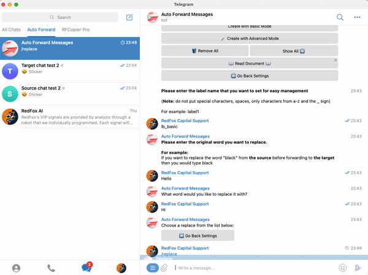
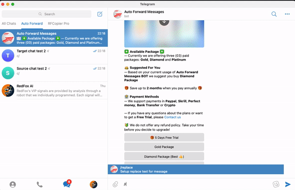
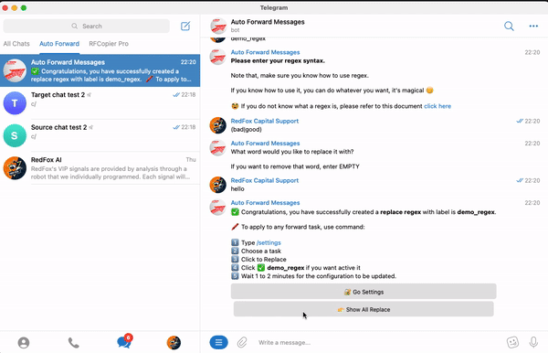
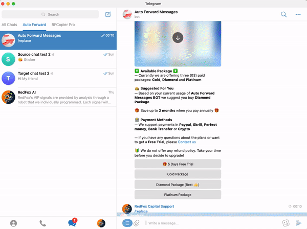
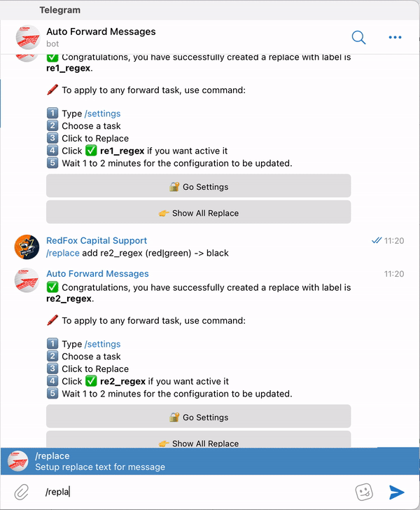

# 🌀 Replace (Without Commands): Create And Management


You can set a list of words or regex patterns which tells the bot that if the message received from source channel has any of the replace words or regex pattern match the bot should replace that message with the word you want to change.



<mark style="color:red;">This feature will not work if you enable "</mark><mark style="color:red;">**Show Forward Headers**</mark><mark style="color:red;">" in task list</mark>


### :new: Create New Replace **Without Commands**


By using the user interface instead of using commands. Make it easier for you to create replace content.


### ⭐️ Create With Basic Mode




When you want to change words, simple characters with another word


1. Use Command **/replace** after select **Create with Basic Mode**
2. **Enter the label name for replace setting**
3. **Follow the instructions from bot**
4. **DONE**




### ⭐️ Create With Advanced Mode (Regex, Sticker)




When you want to change words, characters, complex phrases to another content. Requires you to have regex knowledge.

🥸 If you do not know what a regex is, please refer to this document [click here](https://www.regular-expressions.info/)



We do not support usage of regex, you are on your own if you decide to use regex. Only use it if you know what you are doing.


1. Use Command **/replace** after select **Create With Advanced Mode**
2. Select **Use Regex**
3. **Enter the label name for replace setting**
4. **Follow the instructions from bot**
5. **DONE**

➡️ **Example for** change **good** or **bad** to **hello**





When you want to change a sticker to a sticker another


1. Use Command **/replace** after select **Create With Advanced Mode**
2. Select **Use Sticker**
3. **Enter the label name for replace setting**
4. **Follow the instructions from bot**
5. **DONE**




### ✅ Apply/Disable Replace For a Task

**1.**  From **Auto Forward Messages BOT** [Choose Task ](how-to-settings-for-task/)you want Apply

**2.**  Select 🔐 **Advanced Configuration** from **Menu Setting**

**3.**  Select **Replace** from **Menu Advanced Configuration to show list replace**

**4.**  Click a your replace you want to **Activate or Deactivate** for Task


Describe Status

🚫  **is status Deactivated**

✅ **is status Activated**


<figure><figcaption>
Apply Replace For Task
</figcaption></figure>

### ✅ Apply/Disable Replace For All Task


When **Apply All Replace for Task** will won't activate for each single task


Use command **/replace** after select **Show All** ▶️

### ✅ Remove All Replace

Use command **/replace** after select **CLEAR ALL**

<figure><figcaption>
Remove All Replace
</figcaption></figure>
