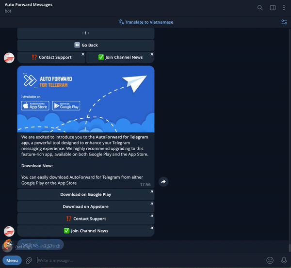

# 💬 Setup Topics For Task


This feature is help **Forward Channel/Group/User to one or more Topics in Group** and

**Forward one or more Topics in Group to Channel/Group/User**&#x20;



* **To do this you need to have task forward already initialized.**
* **Topics are only supported when the source or target is a Group**


## &#x20;❇️ If you don't have any task forward. Please create first

### 👉 Create New Task AutoForward


**How to get SOURCE\_CHAT\_ID and TARGET\_CHAT\_ID?**

* This commands needs input from the [**/getchanel**](../guides/get-information-channels-groups-your-account.md) or [**/getgroup**](../guides/get-information-channels-groups-your-account.md) or [**/getuser**](../guides/get-information-channels-groups-your-account.md)
* You can only use source and target id's you find via [**/getchanel**](../guides/get-information-channels-groups-your-account.md) or [**/getgroup**](../guides/get-information-channels-groups-your-account.md) or [**/getuser**](../guides/get-information-channels-groups-your-account.md)




**Use the following syntax for adding channels/users/bots:**\
`/forward add [LABEL_TASK] [SOURCE_CHAT_ID] -> [TARGET_CHAT_ID]`

**Command other**

`/forward remove [LABEL_TASK]`

`/forward start [LABEL_TASK]`

`/forward stop [LABEL_TASK]`

**\*Arguments**

* **SOURCE\_CHAT\_ID** -> The destination chat you want to use the BOT command with. Can be user, bot, channel, group or supergroup.
* **TARGET\_CHAT\_ID** -> The destination chat you want to use the BOT command with. Can be user, bot, channel, group or supergroup.
* **LABEL\_TASK:** Label name that you want to create to control forward actions.

\=> View more at [how-to-setup-new-task-auto-forward.md](../guides/how-to-setup-new-task-auto-forward.md "mention")



**One to One**\
`/forward add work1 22222 -> 66666`\
\
**Many to One**\
`/forward add work1 22222,33333 -> 66666`\
\
**One to Many**\
`/forward add work1 22222 -> 66666,77777`\
\
**Many to Many**\
`/forward add work1 22222,33333 -> 66666,77777`\
\
\===============\
\
**Remove task with label work1 in list**\
`/forward remove work1`\
\
**Start task with label work1 in list**\
`/forward start work1`\
\
**Stop task with label work1 in list**\
`/forward stop work1`\


**Set delay 30 seconds to each message with label work1** \
`/forward delay work1 30`\


**Set maximum time limit to receive message edit event from SOURCE\_ID is 30 seconds with label work1** \
`/forward max_time_edit work1 30`

\
**Restart all process if any error**\
`/forward restart`\
\
**Show all list task**\
`/forward task`



## ❇️ How to activate topic for Task Forward?&#x20;

### 👉 Forward From <mark style="color:blue;">Channel/Group/User</mark> to <mark style="color:green;">One or More Topics</mark> in Task


**Target Chat must is group and support Topics**


**Use command to get and access to Task**


**/settings** or **/forward**




**1.** After typing the command, select **Manage Forwarding Tasks** or **Show ALL** to show all your list Task.\
**2.** Next click a **Task**  you want settings.

<figure><figcaption><p>Detail Task</p></figcaption></figure>

3. Next Select **Target Topic** to **show list topic in group**
4. **At here click to topic you want activate**


```
🚫  is status Deactivated
✅  is status Activated
```


<figure><figcaption><p>List Topic in Group</p></figcaption></figure>

5. **Done**

<figure><figcaption><p>Activated Topics</p></figcaption></figure>



## 👉 Forward From <mark style="color:green;">One or More Topics</mark> to <mark style="color:blue;">Channel/Group/User</mark> in Task


**Source Chat must is group and support Topics**


**Use command to get and access to Task**


**/settings** or **/forward**




**1.** After typing the command, select **Manage Forwarding Tasks** or **Show ALL** to show all your list Task.\
**2.** Next click a **Task**  you want settings.

<figure><figcaption><p>Detail Task</p></figcaption></figure>

3. Next Select **Source Topic** to **show list topic in group**
4. **At here click to topic you want activate**


```
🚫  is status Deactivated
✅  is status Activated
```


<figure><figcaption><p>List Topic in Group</p></figcaption></figure>

5. **Done**

<figure><figcaption><p>Activated Topics</p></figcaption></figure>




