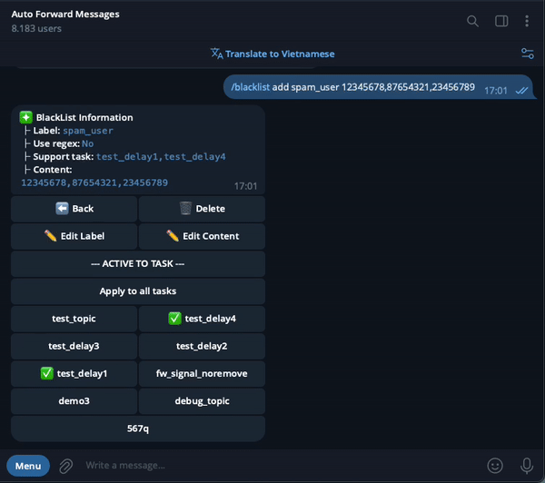
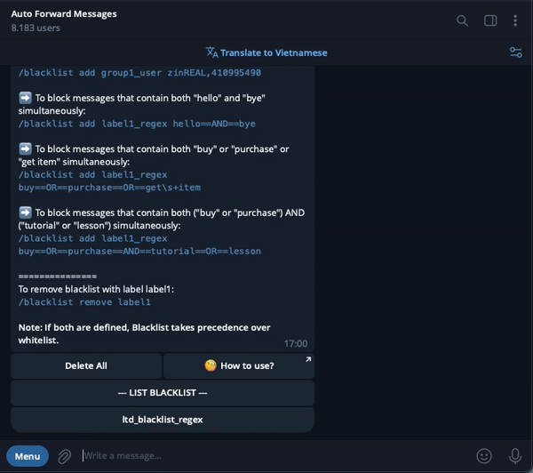

# Users Filter


### **Download Mobile App or use Web**

✅ **iOS** → [App Store](https://apps.apple.com/us/app/autoforward-for-telegram/id6447486093)\
✅ **Android** → [Google Play](https://play.google.com/store/apps/details?id=com.autoforward.telegramforward)\
✅ **Web** → [web.autoforwardtelegram.com](https://web.autoforwardtelegram.com/)


## 1. Filters user use Whitelist  ( Only Platinum Plan)

This feature allows you to forward messages only from specific users that you select. By using a **Whitelist**, you can specify which users' messages should be forwarded by their **USER\_ID** or **USER\_NAME**.

1. **To use this feature, you'll first need to find the User ID of the users you want to whitelist. Follow these steps:**
   * Search for the [@**FindMyIDs\_Bot**](https://t.me/FindMyIDs_Bot) on Telegram or access it via this [link](https://t.me/FindMyIDs_Bot).&#x20;
   * Click **Start** to begin using the bot.
   * Forward any message from the user to the bot.

<figure><figcaption></figcaption></figure>

2. **Next,** use the following syntax to create filters based on the whitelist of users:


```
/whitelist [ACTION] [LABEL]_user [USER_ID1,USER_ID2,...,USERNAME1,USERNAME2,...]
```


**Explanation:**

* `[ACTION]`: The action you want to take (e.g., add, remove, or list).
* `[LABEL]_user`: The label you assign to this whitelist (e.g., `trusted_user`, `groupA_user`).
* `[USER_ID1,USER_ID2,...]`: A list of User IDs.
* `[USERNAME1,USERNAME2,...]`: A list of Usernames.
* You can mix User IDs and Usernames in the same command.

**Example Usage:**

*   Add multiple users to a whitelist using their User IDs:

    <pre class="language-plaintext" data-overflow="wrap"><code class="lang-plaintext">/whitelist add groupA_user 12345678,87654321,23456789
    </code></pre>
*   Add multiple users to a whitelist using their Usernames:

    <pre class="language-plaintext" data-overflow="wrap"><code class="lang-plaintext">/whitelist add vip_user johndoe,janedoe,alice123
    </code></pre>
*   Add users to a whitelist using both User IDs and Usernames:

    <pre class="language-plaintext" data-overflow="wrap"><code class="lang-plaintext">/whitelist add trusted_user 12345678,johndoe,87654321,alice123
    </code></pre>
*   Add a single user to a whitelist using a User ID:

    <pre class="language-plaintext" data-overflow="wrap"><code class="lang-plaintext">/whitelist add staff_user 98765432
    </code></pre>
*   Add a single user to a whitelist using a Username:

    <pre class="language-plaintext" data-overflow="wrap"><code class="lang-plaintext">/whitelist add client_user janedoe
    </code></pre>

This flexibility allows you to manage your whitelist efficiently, accommodating both User IDs and Usernames as needed.

### Apply/Deactivate Whitelist for a Task

<figure><figcaption><p>Example whitelist</p></figcaption></figure>

#### **Step-by-Step Guide to Using the Whitelist Feature:**

1.  **Step 1: Create the Whitelist Command**

    * Start by creating a command to whitelist specific users. Use the following syntax:

    ```plaintext
    /whitelist add [LABEL]_user [USER_ID,USER_NAME]
    ```

    * Replace `[LABEL]_user` with a name for your whitelist (e.g., `trusted_user`), and `[USER_ID,USER_NAME]` with the IDs or usernames of the users you want to whitelist.
2. **Step 2: Send the Command to the BOT**
   * Once you’ve created the command, send it to the AutoForward Telegram Bot.
   * The BOT will then process your request to create the whitelist.
3. **Step 3: BOT Displays Your Task List**
   * After the BOT successfully creates the whitelist, it will display a list of your active tasks.
   * These tasks represent the forwarding activities where you can apply or remove the whitelist.
4. **Step 4: Apply or Remove the Whitelist from a Task**
   * Review the list of tasks provided by the BOT.
   * Choose the task(s) where you want to apply the whitelist or remove it if it's already applied.
   * This allows you to control which tasks are affected by the whitelist, ensuring only messages from specified users are forwarded.

This guide outlines the process from creating a whitelist to applying it to specific tasks, helping you manage which users' messages are forwarded.

## 2. Filters user use Blacklist  ( Only Platinum Plan)

The blacklist feature allows you to block or ignore messages from specific users. By adding users to a **Blacklist** using their **USER\_ID** or **USER\_NAME**, you can ensure that messages from these users will not be forwarded.

1. **To use this feature, you'll first need to find the User ID of the users you want to blacklist. Follow these steps:**
   * **Go to the chat** where you want to receive messages from specific users.
   * **Use the command** `/getid` in the chat.
   * **Note down the User ID** that appears. You can then add this User ID to your **blacklist**.

<div align="center" data-full-width="true"><figure><figcaption><p>Example</p></figcaption></figure></div>


**Note: To use the `/getid` command, please make sure you are using a Telegram account that is connected to the AutoForward Telegram Bot.**


2. **Next,** use the following syntax to create filters based on the blacklist of users:


```
/blacklist [ACTION] [LABEL]_user [USER_ID1,USER_ID2,...,USERNAME1,USERNAME2,...]
```


**Explanation:**

* `[ACTION]`: The action you want to take (e.g., add, remove, or list).
* `[LABEL]_user`: The label you assign to this blacklist (e.g., `block_user`, `spam_user`).
* `[USER_ID1,USER_ID2,...]`: A list of User IDs.
* `[USERNAME1,USERNAME2,...]`: A list of Usernames.
* You can mix User IDs and Usernames in the same command.

**Example Usage:**

*   Block multiple users to a blacklist using their User IDs:

    <pre class="language-plaintext" data-overflow="wrap"><code class="lang-plaintext">/blacklist add spam_user 12345678,87654321,23456789
    </code></pre>
*   Block multiple users to a blacklist using their Usernames:

    <pre class="language-plaintext" data-overflow="wrap"><code class="lang-plaintext">/blacklist add blocked_user johndoe,janedoe,alice123
    </code></pre>
*   Block users to a blacklist using both User IDs and Usernames:

    <pre class="language-plaintext" data-overflow="wrap"><code class="lang-plaintext">/blacklist add unwanted_user 12345678,johndoe,87654321,alice123
    </code></pre>
*   Block a single user to a blacklist using a User ID:

    <pre class="language-plaintext" data-overflow="wrap"><code class="lang-plaintext">/blacklist add blocked_user 98765432
    </code></pre>
*   Block a single user to a blacklist using a Username:

    <pre class="language-plaintext" data-overflow="wrap"><code class="lang-plaintext">/blacklist add spam_user janedoe
    </code></pre>

This flexibility allows you to manage your blacklist efficiently, accommodating both User IDs and Usernames as needed.

### Apply/Deactivate Blacklist for a Task

<figure><figcaption><p>Example Blacklist</p></figcaption></figure>

#### **Step-by-Step Guide to Using the Blacklist Feature:**

1.  **Step 1: Create the Blacklist Command**

    * First, you need to create a command to blacklist specific users. Use the syntax:

    ```plaintext
    /blacklist add [LABEL]_user [USER_ID,USER_NAME]

    ```

    * Replace `[LABEL]_user` with a name for your blacklist (e.g., `spam_user`), and `[USER_ID,USER_NAME]` with the IDs or usernames of the users you want to blacklist.
2. **Step 2: Send the Command to the BOT**
   * After creating the command, send it to the AutoForward Telegram Bot.
   * The BOT will process your request to create the blacklist.
3. **Step 3: BOT Displays Your Task List**
   * Once the BOT has successfully created the blacklist, it will display a list of your tasks.
   * These tasks include all the active forwarding tasks where you can apply or remove the blacklist.
4. **Step 4: Apply or Remove the Blacklist from a Task**
   * Review the list of tasks shown by the BOT.
   * Select the task(s) where you want to apply the blacklist, or remove the blacklist if it's already applied.
   * This allows you to control which tasks are affected by the blacklist, ensuring only the appropriate messages are blocked.

This guide walks you through the entire process, from creating a blacklist to applying it to specific forwarding tasks.
