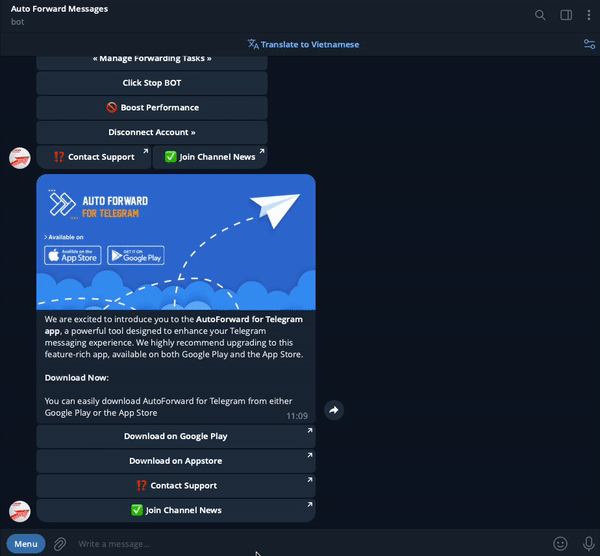
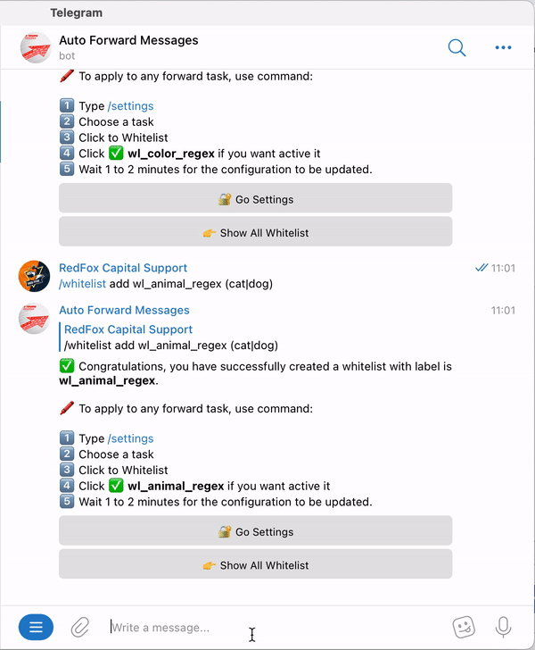
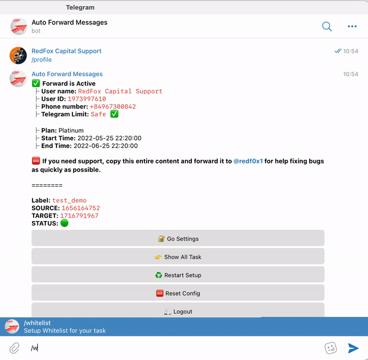

# ✅ Whitelist: Create And Management


You can set a list of words or regex patterns that tell the bot **to process message** you receive from source channel **only if it has at least one** of the whitelisted word or regex pattern match. Make sure to use the right syntax by reading the examples below.



**Important Information**

* Using **Simple Syntax** will match words partially. This means that when you whitelist the word **"es"**, it will allow every message containing b**es**t, r**es**t, t**es**t because each of them have the word **"es"** within.
* If you want to match words fully, please use the regex example
* Make sure to use the **Python Flavor** with [regex101.com](https://regex101.com/) otherwise your regex will not work on
* When this command is used incorrectly, it will cause redirections to stop working. Always make sure you use the right syntax when using whitelist and do use regex only **if necessary.** Make sure you build your regex with [regex101.com](https://regex101.com/) before inserting them into **Auto Forward Bot**.


### &#x20;⛳️ Create New Whitelist



#### Basic Command

`/whitelist [ACTION] [LABEL] [WORD_LIST]`

#### Advanced Command

`/whitelist [ACTION] [LABEL]_regex [WORD_LIST]`

**Command Information**

* **ACTION**  is **add or remove**
* **LABEL** is the nickname you want to define for your **Whitelist**.
* Do not use number for **LABEL**.&#x20;
* To create whitelist advance with regex please add **LABEL** suffix is **\_regex**
* **WORD\_LIST** is list word you want use as whitelist. Check Tab **Example**



➡️ Only messages containing _**hello**_ characters will be forwarded: \
`/whitelist add white1 hello`

\
➡️ Only messages containing _**cat**_ or **dog** or **chicken** characters will be forwarded: \
`/whitelist add white1 cat,dog,chicken`

\
➡️ Remove word list with label **white1**\
`/whitelist remove white1`

\
➡️ Show all list Whitelist \
`/whitelist showall`




Use the syntax as shown below when you want to achive result that is not possible with the simple syntax. This syntax uses regex to search for words and its more powerful than Simple Syntax.

**We do not support usage of regex, you are on your own if you decide to use regex. Only use it if you know what you are doing.**


➡️ Process messages only if it has the any **@mention** word on it.\
`/whitelist add white1_regex @\S+`

\
➡️ Process messages only if it has any "telegram links"\
`/whitelist add white2_regex (telegram.me|t.me)/\w+`

\
➡️ Process messages only if it has the word **black** or **white**\
`/whitelist add white3_regex (black|white)`

\
➡️ Process messages only if it has the word **es** fully (refer to **Important Information**)\
`/whitelist add white3_regex \bes\b`



### &#x20;✅ Apply/Deactivate Whitelist for a Task

**1.**  From **Auto Forward Messages BOT** [Choose Task ](how-to-settings-for-task/)you want Apply

**2.**  Select 🔐 **Advanced Configuration** from **Menu Setting**

**3.**  Select **Whitelist** from **Menu Advanced Configuration to show list Whitelist**

**4.**  Click a your **Whitelist** you want to **Activate or Deactivate** for Task


Describe Status

🚫  **is status Deactivated**

✅ **is status Activated**


<figure><figcaption>
Apply Blacklist For Task
</figcaption></figure>

### &#x20;✅ Apply/Disable Whitelist for All Task


When **Apply All Whitelist for Task** will won't activate for each single task


Use Command **/whitelist** after select **Show All Whitelist**

### &#x20;⭕️ Remove All Whitelist

Use Command **/whitelist** after select **Remove All Whitelist**


Create new whitelist

