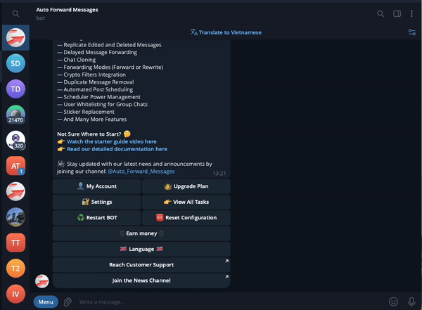

# ✅ Whitelist: Create And Management


You can set a list of words or regex patterns that tell the bot **to process message** you receive from source channel **only if it has at least one** of the whitelisted word or regex pattern match. Make sure to use the right syntax by reading the examples below.



**Important Information**

* Using **Simple Syntax** will match words partially. This means that when you whitelist the word **"es"**, it will allow every message containing b**es**t, r**es**t, t**es**t because each of them have the word **"es"** within.
* If you want to match words fully, please use the regex example
* Make sure to use the **Python Flavor** with [regex101.com](https://regex101.com/) otherwise your regex will not work on
* When this command is used incorrectly, it will cause redirections to stop working. Always make sure you use the right syntax when using whitelist and do use regex only **if necessary.** Make sure you build your regex with [regex101.com](https://regex101.com/) before inserting them into **Auto Forward Bot**.


## &#x20;Create New Whitelist

### 1. Basic Command


```
/whitelist [ACTION] [LABEL] [WORD_LIST]
```


**Command Information**

* **ACTION**  is **add or remove**
* **LABEL** is the nickname you want to define for your **Whitelist**.
* Do not use number for **LABEL**.&#x20;
* **WORD\_LIST** is list word you want use as whitelist. Check Example

❇️  **Example** ❇️

➡️ Only messages containing _**hello**_ characters will be forwarded: \
`/whitelist add white1 hello`

➡️ Only messages containing _**hello**_ characters will be forwarded: \
`/whitelist add white1 hello`

➡️ Only messages containing _**cat**_ or **dog** or **chicken** characters will be forwarded: \
`/whitelist add white1 cat,dog,chicken`

➡️ Remove word list with label **white1**\
`/whitelist remove white1`

➡️ Show all list Whitelist \
`/whitelist`

### 2. Advanced Command with regex ( Only Platinum)


Use the syntax as shown below when you want to achieve result that is not possible with the simple syntax. This syntax uses regex to search for words and its more powerful than Simple Syntax.

**We do not support usage of regex, you are on your own if you decide to use regex. Only use it if you know what you are doing.**



```
/whitelist [ACTION] [LABEL]_regex [WORD_LIST]
```


**Command Information**

* **ACTION**  is **add or remove**
* **LABEL** is the nickname you want to define for your **Whitelist**.
* Do not use number for **LABEL**.&#x20;
* To create whitelist advance with regex please add **LABEL** suffix is **\_regex**
* **WORD\_LIST** is list word you want use as whitelist


\***\*When using regex for spaces, please add a \ character in front or use \s+.**


❇️  **Example** ❇️

➡️ Process messages only if it has the any **@mention** word on it.\
`/whitelist add white1_regex @\S+`

➡️ Process messages only if it has any "telegram links"\
`/whitelist add white2_regex (telegram.me|t.me)/\w+`

➡️ Process messages only if it has the word **black** or **white**\
`/whitelist add white3_regex (black|white)`

* **black and white :** The words `black` and `white` are two words you want forward if have one or both
* In case you want to match more, you can add more **|red|blue** in regex

➡️ Process messages only if it has the word **es** fully (refer to **Important Information**)\
`/whitelist add white3_regex \bes\b`

➡️ Process messages only if it has the word **word1 and word2** fully (refer to **Important Information**)\
`/whitelist add white3_regex ^(?=.\bwork1\`_`b)(?=.`_`\bwork2\b).*$`&#x20;

* **work1 and work2 :** The words work1 and work2 are two words you want to have in the forward content
* In case you want to match more, you can add more _**(?=.**_**\bwork3\b)**_**(?=.**_**\bwork4\b)** in regex


```
* When add whitelist is ^(?=.\bwork1\b)(?=.\bwork2\b).*$ it will only process messages have contain work1 and work2 like:
  "I have work1 to do and work2 as well."
  "work1 and work2 are both important."
  "work2 is harder than work1."
* Will block if not have both work1 and work2 or only have work1 or work2 like:
  "Only work1 is left."
  "work2 is complete"
  "Nothing to do here."
```


### 4. Combined many Words or Expression regex ( Only Platinum)


```
/whitelist [ACTION] [LABEL]_regex [WORD_LIST] ==AND== [WORD_LIST]
```


**Command Information**

* **ACTION**  is **add or remove**
* **LABEL** is the nickname you want to define for your **Whitelist**.
* Do not use number for **LABEL**.&#x20;
* To create whitelist advance with regex please add **LABEL** suffix is **\_regex**
* **WORD\_LIST or Expression regex** is list word or expression regex you want use as whitelist.
* **==AND==**  is the conditional keyword (required)

❇️  **Example** ❇️

*   ➡️ Process messages only if it has the words **black** and **white**\
    `/whitelist add whiteAndBlack_regex black==AND==white`

    ➡️ Process messages only if it has the word **vip1** and **vip2** and (**vip3 or vip4)**\
    `/whitelist add vip_regex vip1==AND==vip2==AND==(vip3|vip4)`

### 5. Filters User use Whitelist  ( Only Platinum Plan)

This feature allows you to forward messages only from specific users that you select. By using a **Whitelist**, you can specify which users' messages should be forwarded by their **USER\_ID** or **USER\_NAME**.

1. **To use this feature, you'll first need to find the User ID of the users you want to whitelist. Follow these steps:**
   * **Go to the chat** where you want to receive messages from specific users.
   * **Use the command** `/getid` in the chat.
   * **Note down the User ID** that appears. You can then add this User ID to your Whitelist.

<div align="center" data-full-width="true"><figure><figcaption><p>Example</p></figcaption></figure></div>


**Note: To use the `/getid` command, please make sure you are using a Telegram account that is connected to the AutoForward Telegram Bot.**


2. **Next,** use the following syntax to create filters based on the whitelist of users:


```
/whitelist [ACTION] [LABEL]_user [USER_ID1,USER_ID2,...,USERNAME1,USERNAME2,...]
```


**Explanation:**

* `[ACTION]`: The action you want to take (e.g., add, remove, or list).
* `[LABEL]_user`: The label you assign to this whitelist (e.g., `trusted_user`, `groupA_user`).
* `[USER_ID1,USER_ID2,...]`: A list of User IDs.
* `[USERNAME1,USERNAME2,...]`: A list of Usernames.
* You can mix User IDs and Usernames in the same command.

**Example Usage:**

*   Add multiple users to a whitelist using their User IDs:

    <pre class="language-plaintext" data-overflow="wrap"><code class="lang-plaintext">/whitelist add groupA_user 12345678,87654321,23456789
    </code></pre>
*   Add multiple users to a whitelist using their Usernames:

    <pre class="language-plaintext" data-overflow="wrap"><code class="lang-plaintext">/whitelist add vip_user johndoe,janedoe,alice123
    </code></pre>
*   Add users to a whitelist using both User IDs and Usernames:

    <pre class="language-plaintext" data-overflow="wrap"><code class="lang-plaintext">/whitelist add trusted_user 12345678,johndoe,87654321,alice123
    </code></pre>
*   Add a single user to a whitelist using a User ID:

    <pre class="language-plaintext" data-overflow="wrap"><code class="lang-plaintext">/whitelist add staff_user 98765432
    </code></pre>
*   Add a single user to a whitelist using a Username:

    <pre class="language-plaintext" data-overflow="wrap"><code class="lang-plaintext">/whitelist add client_user janedoe
    </code></pre>

This flexibility allows you to manage your whitelist efficiently, accommodating both User IDs and Usernames as needed.

## Apply/Deactivate Whitelist for Task

**1.**  From **Auto Forward Messages BOT** typing command `/whitelist`  to show list whitelist

**2.** From **your list whitelist** choose item whitelist you want apply. Then choose will goto detail whitelist

**3.**  At **detail whitelist** will show all your task forward&#x20;

**4.**  **Now you can click to task will apply or click apply to all task if want apply for all**&#x20;


Describe Status

**Normal status  is Deactivate**

✅ **is status Activated**


<figure><figcaption></figcaption></figure>

## Remove All Whitelist

&#x20;⭕️ Use Command **`/whitelist`** then select **Delete All**

<figure><figcaption></figcaption></figure>

## Video Whitelist


Create new whitelist

