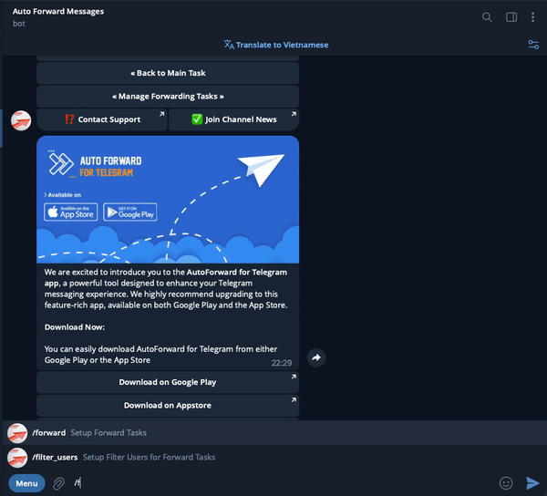

# 💫 How To Setup New Task Auto Forward

### ⛳️ Create New Task



**Use the following syntax for adding channels/users/bots:**\
`/forward add [LABEL] [SOURCE_CHAT_ID] -> [TARGET_CHAT_ID]`

**Command other**

`/forward remove [LABEL]`

`/forward start [LABEL]`

`/forward stop [LABEL]`



**One to One**\
`/forward add work1 22222 -> 66666`\
\
**Many to One**\
`/forward add work1 22222,33333 -> 66666`\
\
**One to Many**\
`/forward add work1 22222 -> 66666,77777`\
\
**Many to Many**\
`/forward add work1 22222,33333 -> 66666,77777`\
\
\===============\
\
**Remove task with label work1 in list**\
`/forward remove work1`\
\
**Start task with label work1 in list**\
`/forward start work1`\
\
**Stop task with label work1 in list**\
`/forward stop work1`\

**Set delay 30 seconds to each message with label work1** \
`/forward delay work1 30`\

**Set maximum time limit to receive message edit event from SOURCE\_ID is 30 seconds with label work1** \
`/forward max_time_edit work1 30`

\
**Restart all process if any error**\
`/forward restart`\
\
**Show all list task**\
`/forward task`




**Command Information**

* **`SOURCE_CHAT_ID`**` ``and`` `**`TARGET_CHAT_ID`**get from command [**/getchanel**](get-information-channels-groups-your-account.md) or [**/getgroup**](get-information-channels-groups-your-account.md) or [**/getuser**](get-information-channels-groups-your-account.md)
* You can only use source and target id's you find via [**/getchanel**](get-information-channels-groups-your-account.md) or [**/getgroup**](get-information-channels-groups-your-account.md) or [**/getuser**](get-information-channels-groups-your-account.md)
* **LABEL** is the nickname you want to define for your Task. This variable is used setup later on every **Auto Forward Telegram BOT** command.
* Do not use number id you give from **/getchanel** or **/getgroup** or **/getuser** for LABEL.&#x20;



Get **`SOURCE_CHAT_ID`** and **`TARGET_CHAT_ID`**


.png>)


Video create a new Task


### 🛠 Management Task (Settings, Delete, Edit)

Use Command **/forward** then select **Show All**

<figure><figcaption>
Manage Task
</figcaption></figure>

