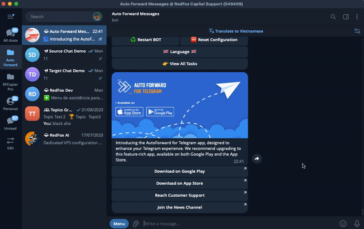

# ♦ How to remove all your personal data?

From Telegram open or search [@Auto\_Forward\_Messages\_Bot](https://t.me/Auto\_Forward\_Messages\_Bot) on telegram and select **Show info account** or typing **/profile** then click to **Logout .** All your personal data has been deleted from our server following your request to disconnect from the bot. Thank you

<figure><figcaption></figcaption></figure>
