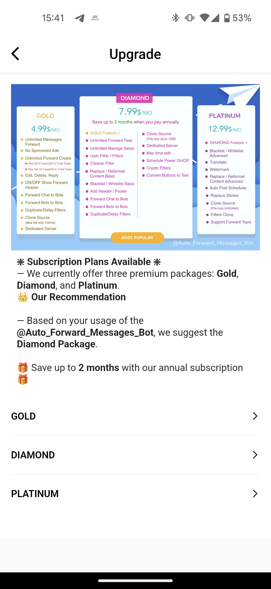

# 🆙 How To Upgrade Current Package?

### Introduction

The AutoForward bot on Telegram offers various service packages with different features. This guide explains how to upgrade your package using two methods: direct payment and mobile app payment.

### Prerequisites

Before upgrading your package, make sure you have:

* An active Telegram account
* The AutoForward bot installed and configured on your Telegram account

### Option 1: Direct Payment

#### Step 1: Access the AutoForward Bot

1. Open your Telegram app.
2. Start a conversation with the [Auto Forward Messages](https://t.me/Auto\_Forward\_Messages\_Bot).

#### Step 2: Check Current Package Details

<figure><figcaption>
Subscription Plans Available
</figcaption></figure>

1. In the bot chat, type `/upgrade` to retrieve information about available upgrade packages.
2. The bot will provide details of the available upgrade options, including features and pricing.

#### Step 3: Make a Direct Payment

1. Select the upgrade package you desire.
2. Follow the bot's instructions to make a direct payment to the specified payment method.
3. **Send the difference payment amount to complete the upgrade.** _<mark style="color:orange;">For example: The current package is Gold 4.99$ and you want to upgrade to Diamond for 7.99$. Please deposit an additional 3$ for the upgrade</mark>_

#### Step 4: Confirmation

1. Send confirm the payment and update your package to [Admin](https://t.me/redf0x1)
2. **The number of days remaining from your previous package will be preserved in the upgraded package.**

### Option 2: Mobile App Payment

✅ [**IOS VERSION**](https://bit.ly/autoforward-for-telegram-ios)      ✅ [**ANDROID VERSION**](https://bit.ly/autoforward-for-telegram-android)

<figure><figcaption></figcaption></figure>

**Step 1: Access Your Mobile App**

1. Open your preferred mobile payment app.

#### Step 2: Upgrade Package

1. In the app's menu home, select the "**Upgrade**" option.
2. Choose the new package you wish to upgrade to.

#### Step 3: Instant Upgrade

1. Upon selecting the package, the new features will be upgraded immediately.
2.  The cost of the new package will be charged, and the remaining value of your previous package will be adjusted accordingly and additional days added to the new package.

    _<mark style="color:orange;">For example: The current package is</mark> <mark style="color:orange;"></mark><mark style="color:orange;">**Gold**</mark> <mark style="color:orange;"></mark><mark style="color:orange;">4.99$ and you want to upgrade to Diamond for 7.99$.</mark> <mark style="color:orange;"></mark><mark style="color:orange;">**Gold**</mark>_ <mark style="color:orange;">subscription ends immediately.</mark> <mark style="color:orange;"></mark>_<mark style="color:orange;">**Diamond**</mark>_ <mark style="color:orange;"></mark><mark style="color:orange;">subscription begins today and he is charged $7.99. Because you paid for a full month for</mark> <mark style="color:orange;"></mark><mark style="color:orange;">**Gold**</mark> <mark style="color:orange;"></mark><mark style="color:orange;">but used only half of it, half of a month's subscription ($2.49) will be adjusted accordingly and additional days added to the new package.</mark>

### Conclusion

You have successfully learned how to upgrade your AutoForward bot package on Telegram using both direct payment and mobile app payment methods. Enjoy the enhanced features and capabilities of your upgraded package.

Please note that the availability of specific packages and payment methods may vary. Be sure to follow the instructions provided by the AutoForward bot and your chosen mobile payment app for a smooth package upgrade process.
