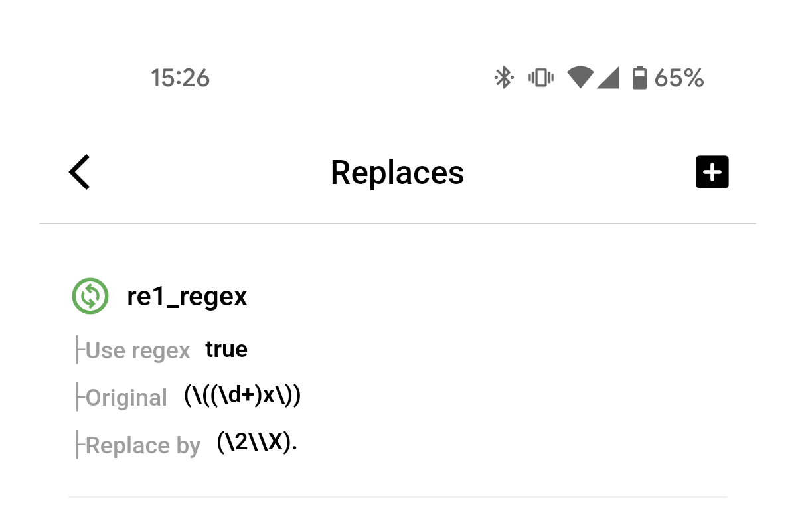

# 🔄 \[Mobile App] Replace: Create And Management

## Open Replace Screen&#x20;

* &#x20;Login Account and open to Home AutoForward

<figure><figcaption>
Home Menu
</figcaption></figure>

* At **Home Menu** select item **Replace** to open **Replace Screen**

## Create New Replace&#x20;

**Step1.** At **Replace Screen** click icon add on top right to create new Replace

<figure><figcaption></figcaption></figure>

**Step2.** At **Replace Create** enter the parameters to create&#x20;


(\*) : Required fill

Optional: can skip


<figure><figcaption></figcaption></figure>

* **Label(\*)**: is the nickname you want to define for your Replace. if use regex please select Basic -> Regex
* **Full Content Original(Optional)**: Is your content before replacing. You may skip it.
* **Original Words(\*)**: is the word or phrase you want to replace. If using regex, enter the syntax here
* **New Words Replace(\*)**: is the word or phrase you will to replace.
* **Apply For Task(Optional)**: If you have created a task before, you can choose to apply it now or skip it and do it later
* <mark style="color:green;">**Once you have filled in the information, click Create Replace to complete**</mark>

## Management and apply for Task

**Step 1.** Open **Replaces Screen**

<figure><figcaption></figcaption></figure>

**Step 2.** At **Replace Screen** click **item Replace you want apply. A popup will show**

<figure><figcaption></figcaption></figure>

**Step 3. Click Activate/Deactivate For Task to show list Task will apply or deactivate**

<figure><figcaption></figcaption></figure>

**Final  click Task you want apply or deactivate to Done**
