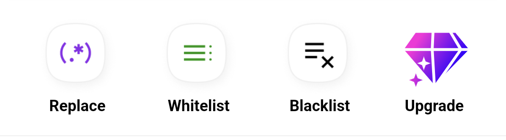

# 🔄 \[Mobile App] Replace: Create And Management

## 1. Create New Replace&#x20;

* Login Account and open to Home AutoForward

<figure><figcaption>
Home Menu
</figcaption></figure>

**Step 1.** At **Home Menu** select item **Replace**

**Step2.**&#x20;

<figure><figcaption></figcaption></figure>

<figure><figcaption></figcaption></figure>

