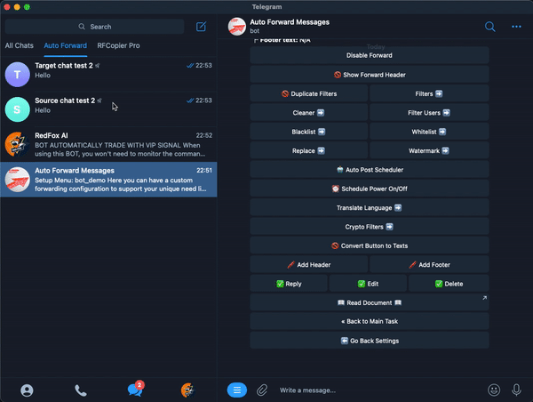

# Convert Buttons To Text


**This is a feature help you convert post buttons to text**



### **Download Mobile App or use Web**

✅ **iOS** → [App Store](https://apps.apple.com/us/app/autoforward-for-telegram/id6447486093)\
✅ **Android** → [Google Play](https://play.google.com/store/apps/details?id=com.autoforward.telegramforward)\
✅ **Web** → [web.autoforwardtelegram.com](https://web.autoforwardtelegram.com/)




✅ Post contain buttons

.png>)

➡️ After Convert To Text:

**Please select the service you are interested in**

VIP SIGNAL

BOT Auto Trade

Cheap Forex VPS

Best ZERO spread Forex Broker

Contact Support





**Follow these steps**

1. Type **/settings** on **Auto Forward Telegram BOT.**&#x20;
2. Click  **Manage Forwarding Task** to show list your Task
3. **Select task you want Convert Buttons To Text**
4. Next click **Advanced Configuration** to can access the setup task forward
5. Finally select **Convert Buttons To Text**

.png>)

**Step 3**. At Menu settings click **Convert Buttons To Text** to ✅ **TURN ON** or click to 🚫 **TURN OFF**

.png>)

### ❇️ DEMO




