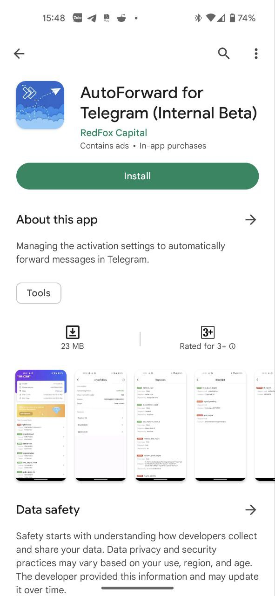

# 🦸 Upgrade From GooglePlay or AppStore

<figure><figcaption></figcaption></figure>

1. Download application AutoForward for Telegram at [Google Play](https://play.google.com/store/apps/details?id=com.autoforward.telegramforward) or [AppStore](https://bit.ly/autoforward-for-telegram-ios)
2. Open app to **Sign In**

3. To get info login please to bot autoforward on telegram and select **Show info account** or typing **/profile** then copy **User ID and Token login**

4. After copy info account comeback to app and fill info and click Sign In.

.png>)

5. At Home Autoforward click to **Join Premium** then select package want join

6. **Click to Subscribe to pay and please wait few seconds to completed.**

7. Final. Send screenshot or copy payment info send to admin [redf0x1](https://t.me/redf0x1) . thankyou
