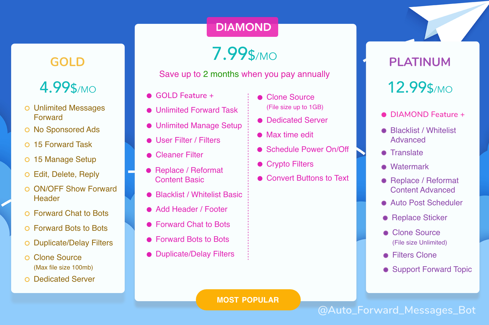

# 🦸 Upgrade package



Typing Command\
`/upgrade`



<figure><figcaption></figcaption></figure>

With @Auto\_Forward\_Messages\_Bot you can use it for **free** or **pay** if you want.

Here are the features available in the **Free Package**:

✅ Sponsored Ads

✅ 5 Forward Tasks

✅ 5 IDs Max

✅ ON/OFF Show Forward Header

🚫 Can't forward to Bots

🚫 Can't edit, delete, reply message same source chat

🚫 Can't use premium feature

📖 Note: **IDs Max** in **Many to One** limit means that you can only use up to 5 chats in SOURCE or TARGET

If you want more advanced features, use the **/upgrade** command to view package details.

If you have any questions, let me know.
