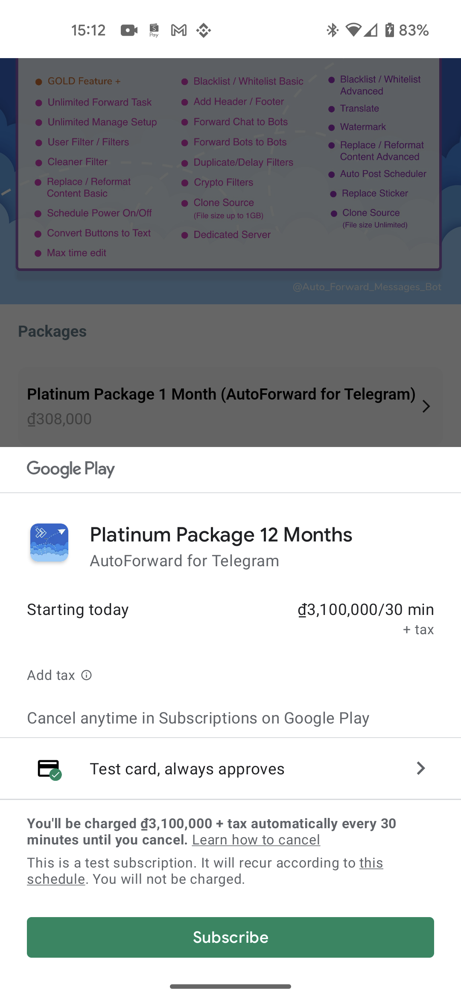
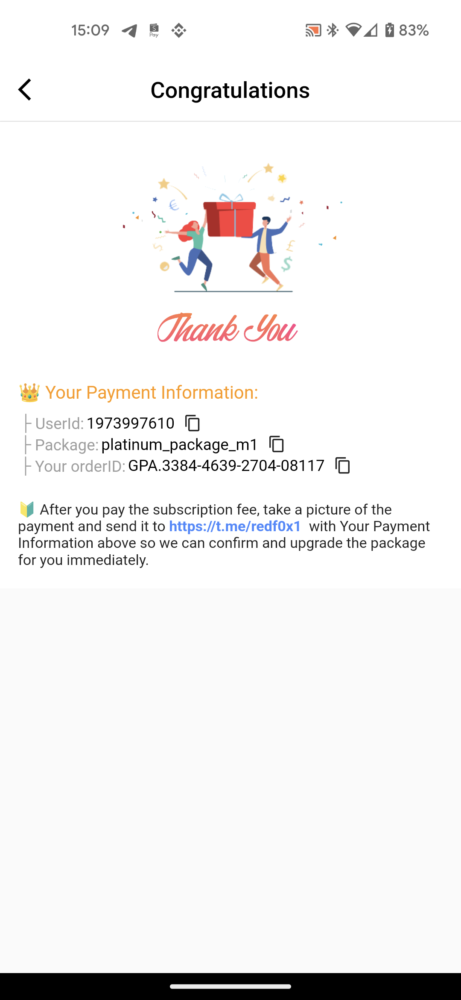

# ⏫ Upgrade Plan via Android/IOS App

<figure><figcaption></figcaption></figure>


### **Download Mobile App or use Web**

✅ **iOS** → [App Store](https://apps.apple.com/us/app/autoforward-for-telegram/id6447486093)\
✅ **Android** → [Google Play](https://play.google.com/store/apps/details?id=com.autoforward.telegramforward)\
✅ **Web** → [web.autoforwardtelegram.com](https://web.autoforwardtelegram.com/)


To get info login please to [bot autoforward on telegram](https://t.me/Auto_Forward_Messages_Bot) and select Settings or typing **/settings** then copy **UserID and Token login**

<figure><figcaption></figcaption></figure>

3. &#x20;After copy info account and back to app select Login with Account and fill info and click **Login Now**.

<figure><figcaption></figcaption></figure>

<figure><figcaption></figcaption></figure>

4. At Home Autoforward click to **item Upgrade** then select package want join.

.jpg>).jpg>)

5. **Click to Subscribe to pay and please wait few seconds to completed.**

6. **Final. if have issue please send screenshot or copy payment info send to** [**Supporter**](https://t.me/BotRedFoxBot) **. Thankyou**
